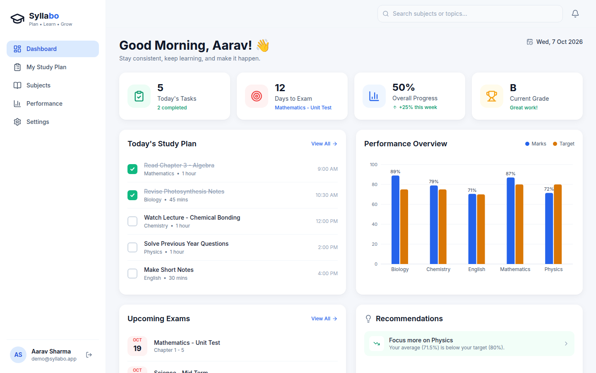
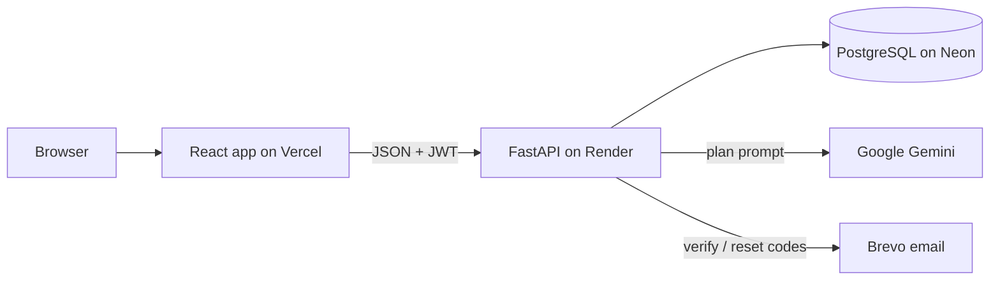

# Syllabo

A study planner I built to help students keep their subjects, exams, marks and daily study tasks in one place.

**Live:** <https://syllabo-app.vercel.app>



## Why I built it

Most students plan in notebooks or a to-do app, and none of it is connected. The to-do list doesn't know when
the exam is, and the mark sheet doesn't tell you which subject is falling behind. Syllabo puts it together and
does the counting for you.

## Features

- Sign-up with a 6-digit email code, login, forgot/reset password, change password
- Subjects with a target score, and topics you tick off as you finish them
- Exams with a countdown, and marks with automatic percentages
- **My Study Plan**: tasks grouped by day, add your own or generate them
- **AI study plan** with Google Gemini: pick a date range, review the preview, save only if you like it
- Dashboard: today's tasks, days to the next exam, syllabus progress, current grade, a marks-vs-target chart
  and subjects that are below target
- Settings for name, timezone, password and study preferences (daily minutes, study days, goal)
- Light and dark mode, works on phones

## Tech stack

- **Frontend:** React 18.3, Vite 5.4, Tailwind CSS 3.4, React Router 6, Axios, Recharts 2.15
- **Backend:** Python 3.12, FastAPI 0.142, SQLAlchemy 2.1, Alembic 1.20, Pydantic 2.13
- **Database:** PostgreSQL on Neon (SQLite when running locally without a `DATABASE_URL`)
- **AI:** Google Gemini (`google-genai` 2.28)
- **Email:** Brevo
- **Hosting:** Vercel (frontend), Render (backend)
- **Tests:** pytest 9, Vitest 2

## How it works

The React app talks to a FastAPI backend over a JSON API, with a JWT in every request. Each route checks that
the data belongs to the logged-in user. The backend works out the dashboard numbers from the database.

For an AI plan, the backend sends Gemini your subjects, unfinished topics, upcoming exams, weak subjects and the
free minutes left on each study day, and asks for JSON only. The answer is checked before you see it. Anything
for an unknown subject, on a day off, or over your daily limit is skipped, and the preview says why. Nothing is
saved until you click Save. A new plan only replaces earlier AI tasks that aren't done yet; your own tasks and
completed tasks are never touched.



## Run it locally

You'll need Python 3.11+, Node 18+ and Git.

```bash
git clone https://github.com/studyaiteam1-dotcom/syllabo.git
cd syllabo
```

### Backend

```bash
cd backend
python3 -m venv .venv
source .venv/bin/activate
pip install -r requirements.txt
alembic upgrade head
python -m app.seed          # optional: demo account with sample data
uvicorn app.main:app --reload
```

The API runs at <http://localhost:8000> and every route is listed at <http://localhost:8000/docs>.

It runs without any settings. With no `backend/.env` it uses a local SQLite file and prints the email codes in
the terminal instead of sending them. To use real services, create `backend/.env` with these variables:

| Variable | What it's for |
| --- | --- |
| `DATABASE_URL` | PostgreSQL connection string (empty = local SQLite) |
| `JWT_SECRET` | secret for signing logins, use a long random value in production |
| `CORS_ORIGINS` | frontend url(s) allowed to call the API |
| `GEMINI_API_KEY`, `GEMINI_MODEL`, `GEMINI_FALLBACK_MODEL` | Gemini key, main model and backup model |
| `EMAIL_PROVIDER` | `console`, `brevo` or `smtp` |
| `BREVO_API_KEY`, `EMAIL_FROM`, `EMAIL_FROM_NAME` | Brevo key and the sender verified in Brevo |
| `ENVIRONMENT` | `production` on the live server, it then refuses to start if something important is missing |

Don't run the seed script against the live database. It resets the demo account.

### Frontend

In a second terminal:

```bash
cd frontend
cp .env.example .env        # sets VITE_API_URL, the backend url
npm install
npm run dev
```

Then open <http://localhost:5173>. If you ran the seed script, log in with `demo@syllabo.app` / `demo1234`.

## API routes

All routes except the sign-up/login ones and `/health` need a `Bearer` token.

| Method | Route | What it does |
| --- | --- | --- |
| POST | `/auth/register` | create an account and email a code |
| POST | `/auth/verify-email` | check the code, returns a token |
| POST | `/auth/resend-code` | send a new verification code |
| POST | `/auth/login` | log in, returns a token |
| POST | `/auth/forgot-password` | email a reset code |
| POST | `/auth/reset-password` | set a new password with the code |
| GET / PATCH | `/auth/me` | get or update your profile |
| POST | `/auth/change-password` | change password, logs out other devices |
| GET / POST | `/subjects` | list (with topics) or add subjects |
| GET / PATCH / DELETE | `/subjects/{id}` | one subject |
| GET / POST | `/subjects/{id}/topics` | list or add topics |
| PATCH / DELETE | `/topics/{id}` | toggle, rename or delete a topic |
| GET / POST | `/exams` | list (`?upcoming=true`) or add exams |
| PATCH / DELETE | `/exams/{id}` | edit or delete an exam |
| GET / POST | `/tasks` | list (`?date=YYYY-MM-DD`) or add tasks |
| PATCH / DELETE | `/tasks/{id}` | edit or delete a task |
| PATCH | `/tasks/{id}/status` | mark a task done or pending |
| GET / POST | `/marks` | list (`?subject_id=`) or add marks |
| PATCH / DELETE | `/marks/{id}` | edit or delete a mark |
| GET / PUT | `/preferences` | study minutes, days and goal |
| GET | `/dashboard/summary` | everything the dashboard shows |
| POST | `/ai/generate-plan` | get a checked plan preview from Gemini |
| POST | `/ai/save-plan` | save a previewed plan |
| GET | `/health` | health check for Render |

## Project structure

```text
backend/     FastAPI app (core, models, schemas, routers, services), alembic migrations, tests
frontend/    React app (api, components, context, pages, utils)
docs/        screenshots
render.yaml  backend hosting config for Render
```

## Running tests

```bash
cd backend && pytest
cd frontend && npm test
```

Backend tests use an in-memory database. Set `TEST_DATABASE_URL` to an empty database to run them against
PostgreSQL.

## Challenges / what I learned

- AI output can't be trusted as-is. I made the backend check every suggested task and show a preview, and it
  checks the plan again on save.
- Render's free plan blocks SMTP, so sign-up emails failed. I switched to Brevo's HTTP API.
- "Today" was off for users far from UTC. Each user now has a timezone, and the backend and frontend both use
  it.
- For dark mode I moved the greys into CSS variables, so the same Tailwind classes work in both themes.

## Known limitations and what's next

- The Render free plan sleeps, so the first request after a while can take 30–60 seconds.
- AI plans depend on Gemini's free quota. When it's busy the app tries a backup model once, then shows a
  message.
- Search and notifications in the top bar are placeholders for now.
- The login rate limit is kept in memory, so it resets on restart and wouldn't be shared across servers.
- Next: search, reminders, a calendar view, and a history of saved plans.
