# Syllabo — Project Report Context

> **Purpose of this file.** This document collects everything a report writer needs to prepare the academic
> project report for **Syllabo**. It was produced by reading the complete source code (backend, frontend,
> tests, migrations, configuration and README). It describes **only what exists in the code**. Where
> something is not present in the code, it is marked **NOT IMPLEMENTED** or **TO BE FILLED BY WRITER**.
>
> No secret values (API keys, passwords, connection strings) appear in this document. Environment variables
> are referred to by **name only**.
>
> Mermaid diagrams can be rendered at <https://mermaid.live> (paste the code, then export as PNG/SVG for the
> report).

---

## Front Matter (short notes)

### Abstract (draft, about 180 words)

Students often plan their studies in notebooks, generic to-do apps or simply in their heads. These methods
do not connect the syllabus, exam dates, test results and daily time available, so students struggle to
see what to study next and which subjects are falling behind. **Syllabo** is a full-stack web application
that brings these pieces together. A student records subjects, topics, exams and marks. The system then
shows a dashboard with today's tasks, a countdown to the next exam, overall syllabus progress, a current
grade and a marks-versus-target chart, and it automatically identifies weak subjects (average mark below
target). Using Google Gemini, Syllabo can generate a day-by-day study plan for a chosen date range that
respects the student's study days and daily time limit and gives priority to nearer exams and weaker
subjects. Every AI suggestion is validated on the server and shown as a preview; nothing is saved until the
student approves it. The system is built with React, Vite and Tailwind CSS on the frontend, FastAPI,
SQLAlchemy and Alembic on the backend, PostgreSQL (Neon) for storage and Brevo for email verification and
password reset. The backend has 40 automated tests and the frontend has 13; all of them pass.

### Originality

- **Review-before-save AI planning:** the AI plan is first returned as a *preview*. The server checks every
  suggested task (subject, topic, study day, daily time limit) and lists anything it skipped and why. Only
  the plan the student approves is saved, and the server checks it again before saving it.
- **Safe regeneration:** regenerating a plan replaces only *pending AI-generated* tasks in that date range.
  Manual tasks and completed tasks are never deleted.
- **Weak-subject detection:** each subject has its own target score. Subjects whose average mark is below
  target are flagged on the dashboard and given priority in the AI prompt.
- **Timezone-aware "today":** each user has a saved timezone. Today's tasks, exam countdowns and the AI
  plan's "today" all follow that timezone.

### Mark Declaration — TO BE FILLED BY WRITER
### Certificate — TO BE FILLED BY WRITER
### Acknowledgement — TO BE FILLED BY WRITER

---

## 1. Introduction

### 1.1 Background

Students in schools and colleges study many subjects at once. Each subject has a syllabus divided into
topics, periodic tests and a final exam on a fixed date. Most students manage this with paper planners,
notebooks, phone reminders or general-purpose to-do lists. These tools hold information but do not
*connect* it: a to-do list does not know when the exam is, a mark sheet does not tell the student which
subject needs more time, and a timetable written once is rarely updated when plans change. As a result,
students often study without structure, discover too late that a subject is behind target, and find it
hard to measure progress through the syllabus.

### 1.2 Motivation and Overview

The motivation for Syllabo was to give students one place where syllabus progress, exams, marks and daily
study tasks live together, so the system can calculate what the student would otherwise work out by hand.

At a high level, Syllabo lets a student:

1. Create an account (verified by an emailed 6-digit code).
2. Add subjects (each with a colour and a target score) and the topics within each subject.
3. Add exams with dates and syllabus notes.
4. Record marks from tests and assessments.
5. Plan study tasks day by day, either manually or by asking the AI to generate a plan.
6. Tick off tasks and topics as they are completed.
7. View a dashboard that summarises today's workload, the next exam, progress, grade, performance per
   subject and recommendations for weak subjects.

### 1.3 Objectives

1. Provide secure user accounts with email verification, login, password reset and password change.
2. Allow students to manage subjects, topics, exams, marks and study tasks (create, view, update, delete).
3. Calculate and display progress automatically: today's tasks, days to the next exam, percentage of topics
   completed, change this week and a letter grade from average marks.
4. Detect weak subjects by comparing each subject's average mark with its target score.
5. Generate a personalised, rule-respecting study plan with Google Gemini, which the student can review and
   approve before it is saved.
6. Keep every user's data private: each user can only see and change their own records.
7. Deploy the system on cloud services (Vercel, Render, Neon) so that it works on desktop and mobile
   browsers.

---

## 2. Software Requirement Analysis

### 2.1 Problem Definition

#### 2.1.1 Existing System

Students currently use one or more of the following:

- **Paper planners and notebooks**: timetables and topic checklists written by hand.
- **Generic to-do or reminder apps**: lists of tasks with due dates and no idea of subjects or syllabus.
- **Spreadsheets**: for marks, kept separately from the study timetable.
- **Memory and informal planning**: deciding each day what to study.

#### 2.1.2 Problems in the Existing System

- Information is spread over several places; nothing links topics, exams, marks and tasks.
- Progress through the syllabus has to be counted by hand.
- Weak subjects are noticed late, because marks are not compared with a goal.
- Building a realistic timetable that fits daily free time and prioritises upcoming exams is slow, so it is
  rarely updated.
- Paper records cannot be reached from another device and are easily lost.
- Generic apps give no summary of how well the student is doing.

#### 2.1.3 Need for the Proposed System

A single, always-available system is needed that stores the student's academic data in one place,
calculates progress and performance automatically, highlights subjects that need attention and helps build
a study timetable quickly. That timetable should still leave the student in control of what is finally
saved.

### 2.2 Proposed System

Syllabo is a web application with a React frontend, a FastAPI REST backend, a PostgreSQL database, Google
Gemini for plan generation and Brevo for transactional email.

#### 2.2.1 Advantages

- **One place for everything:** subjects, topics, exams, marks and tasks are linked in one database.
- **Automatic analytics:** progress percentage, weekly change, grade, days to exam and per-subject average
  are calculated by the server.
- **Weak-subject alerts:** the dashboard recommends focusing on subjects below their target.
- **AI-assisted planning with control:** the student sees a preview, can regenerate or cancel, and only
  saves what they approve. The server enforces study days and daily minute limits.
- **Non-destructive regeneration:** manual and completed tasks are never removed by a new AI plan.
- **Secure:** hashed passwords (bcrypt), signed JWT tokens, email verification, rate limiting and per-user
  data isolation.
- **Accessible anywhere:** a responsive web interface that works on phones (collapsible sidebar).
- **Works without AI:** if Gemini is not configured, every other feature still works.

#### 2.2.2 Scope

**In scope (implemented):**

- Registration with email verification; login; logout; forgot/reset password; change password; profile
  (name, timezone).
- Subjects (name, colour, target score) and topics (pending/completed).
- Exams (title, optional subject, syllabus, date) with an "upcoming only" filter.
- Marks (assessment, score, maximum score, date), with automatic percentage.
- Study tasks (manual or AI), grouped by day, with complete/edit/delete.
- Study preferences (daily minutes, study days, goal note).
- Dashboard summary and performance bar chart.
- AI study plan generation (preview, regenerate, save) for up to 31 days.
- Email via Brevo HTTP API, any SMTP server, or console (development).
- Demo data seed script.

**Out of scope (NOT IMPLEMENTED in the code):**

- AI chat assistant, Calendar page and Notes page (they were built earlier but removed in the commit
  "Remove the AI Assistant, Calendar and Notes pages").
- Search: the search box in the top bar is **disabled** ("Search is coming soon").
- Notifications: the bell icon is **visual only** ("Notifications are coming soon").
- Push/email reminders, file uploads, sharing with teachers or parents, an admin panel, a native mobile app
  and offline mode.

### 2.3 Modules and Functionalities

#### 2.3.1 Module Description

All endpoints except `/auth/register`, `/auth/verify-email`, `/auth/resend-code`, `/auth/login`,
`/auth/forgot-password`, `/auth/reset-password` and `/health` require a valid JWT in the
`Authorization: Bearer <token>` header.

##### Module 1 — Authentication and Account (incl. email verification and password reset)

- **Purpose:** create and protect user accounts.
- **Features:**
  - Registration with name, email, password (6–72 characters) and the browser's timezone.
  - Email address check: the domain must be able to receive mail (DNS deliverability check) and must not
    be a known disposable-inbox provider (about 50 domains, such as mailinator.com and yopmail.com).
  - A 6-digit one-time code is emailed. It is stored only as an HMAC-SHA256 hash, expires after
    **10 minutes**, allows at most **5 wrong attempts**, and can be resent only after a **60-second**
    cooldown.
  - Login is refused (HTTP 403, code `email_not_verified`) until the email is verified. If the old code has
    expired, a new one is sent automatically.
  - Forgot password: emails a reset code. The response is the same whether or not the account exists, so
    attackers cannot discover which emails are registered.
  - Reset password and change password both increase `token_version`, which logs out every other session.
  - Profile update (name, timezone).
  - Rate limiting: at most 10 attempts per client IP per 5 minutes, counted separately for "login", "code"
    and "send" actions.
- **Endpoints:**

| Method | Path | Description |
| --- | --- | --- |
| POST | `/auth/register` | Create an unverified account and email a code |
| POST | `/auth/verify-email` | Submit the code; returns a JWT and the user |
| POST | `/auth/resend-code` | Send a new verification code |
| POST | `/auth/login` | Log in; returns a JWT and the user |
| POST | `/auth/forgot-password` | Email a password-reset code |
| POST | `/auth/reset-password` | Set a new password using the code |
| GET | `/auth/me` | Current user's profile |
| PATCH | `/auth/me` | Update name/timezone |
| POST | `/auth/change-password` | Change password (needs the current password) |

##### Module 2 — Subjects and Topics

- **Purpose:** hold the syllabus structure.
- **Features:** add/edit/delete subjects with a colour (8 preset colours in the UI, any `#RRGGBB` in the
  API) and a target score (0–100, default 75). Add/rename/delete topics. Toggle a topic between *pending*
  and *completed*; the completion time is recorded. A progress bar on each subject card shows completed
  topics as a percentage. Deleting a subject also deletes its topics, tasks and marks.
- **Endpoints:**

| Method | Path | Description |
| --- | --- | --- |
| GET | `/subjects` | List subjects with nested topics |
| POST | `/subjects` | Create a subject |
| GET | `/subjects/{id}` | Get one subject |
| PATCH | `/subjects/{id}` | Update a subject |
| DELETE | `/subjects/{id}` | Delete a subject (cascades) |
| GET | `/subjects/{id}/topics` | List a subject's topics |
| POST | `/subjects/{id}/topics` | Add a topic |
| PATCH | `/topics/{id}` | Empty body toggles status; or set `status`/`name` explicitly |
| DELETE | `/topics/{id}` | Delete a topic |

##### Module 3 — Exams

- **Purpose:** track exam dates and syllabus notes.
- **Features:** add/edit/delete exams. The subject link is optional ("General"). Exams are listed in date
  order. `?upcoming=true` returns only exams dated today or later, using the user's timezone. Past exams are
  shown faded with "(past)" in the UI.
- **Endpoints:** `GET /exams`, `POST /exams`, `PATCH /exams/{id}`, `DELETE /exams/{id}`.

##### Module 4 — Study Tasks / Planner ("My Study Plan")

- **Purpose:** the student's day-by-day list of study tasks.
- **Features:** add a task with title, subject, optional topic (must belong to that subject), date,
  optional start time and duration (5–960 minutes, default 60). Tasks are grouped by date with
  "Today"/"Tomorrow" labels, a done count and the total time per day. Views: "Upcoming" and "All tasks".
  Tasks can be marked complete or pending (the screen updates immediately and rolls back if the request
  fails), edited and deleted. AI tasks show an "AI" badge. Editing an AI task turns it into a manual task,
  so a later regeneration will not replace it.
- **Endpoints:** `GET /tasks` (optional `?date=YYYY-MM-DD`), `POST /tasks`, `PATCH /tasks/{id}`,
  `PATCH /tasks/{id}/status`, `DELETE /tasks/{id}`.

##### Module 5 — Study Preferences

- **Purpose:** the inputs the AI planner uses.
- **Features:** daily study minutes (15–960, default 120), study days (any of Mon–Sun, default
  Mon–Sat, stored in week order without duplicates) and a free-text goal. The record is created
  automatically the first time it is read. Edited in a collapsible "Study settings" panel on My Study Plan
  and on Settings.
- **Endpoints:** `GET /preferences`, `PUT /preferences`.

##### Module 6 — Marks and Performance

- **Purpose:** record assessment results and compare them with targets.
- **Features:** add/edit/delete marks (subject, assessment name, score ≥ 0, max score > 0, score ≤ max
  score, date). The percentage is calculated automatically (rounded to 1 decimal place). Optional
  `?subject_id=` filter. Past marks table (newest first) and the performance bar chart.
- **Endpoints:** `GET /marks`, `POST /marks`, `PATCH /marks/{id}`, `DELETE /marks/{id}`.

##### Module 7 — Dashboard and Analytics

- **Purpose:** a single summary of the student's situation.
- **Calculations (`dashboard_service.py`):**
  - `today_tasks_total` and `today_tasks_completed`: tasks scheduled for today in the user's timezone.
  - `days_to_next_exam` and `next_exam`: the earliest exam dated today or later.
  - `overall_progress` = completed topics ÷ all topics × 100 (0 if there are no topics).
  - `progress_change_this_week` = topics completed in the last 7 days ÷ all topics × 100.
  - `current_grade` from the average percentage of **all** marks: A ≥ 80, B ≥ 65, C ≥ 50, D ≥ 35, otherwise
    F; empty if there are no marks.
  - `subject_performance`: for each subject, the average mark percentage (empty if no marks) and the
    target.
  - `weak_subjects`: subjects that have marks and whose average is below target.
- **Endpoint:** `GET /dashboard/summary`.

##### Module 8 — AI Study Plan Generation

- **Purpose:** produce a draft study timetable with Google Gemini.
- **Features:** the student chooses a date range (maximum 31 days, end date on or after start date). The
  server gathers subjects, pending topics, upcoming exams, performance and weak subjects, preferences and
  the minutes still free on each study day, then asks Gemini for a JSON-only plan. The answer is checked
  and mapped to real subject and topic IDs. Invalid suggestions are skipped with a reason. A preview is
  returned. On save, the plan is checked again, earlier *pending AI* tasks in the range are replaced and new
  tasks are created with `source = 'ai'`.
- **Endpoints:**

| Method | Path | Description |
| --- | --- | --- |
| POST | `/ai/generate-plan` | Body `{start_date, end_date}` → validated preview (nothing saved) |
| POST | `/ai/save-plan` | Body `{start_date, end_date, days:[...]}` → saves; returns `plan_id`, `tasks_created`, `tasks_replaced` |

##### Module 9 — Email Service (Brevo / SMTP / Console)

- **Purpose:** deliver verification and password-reset codes.
- **Features:** three providers chosen by `EMAIL_PROVIDER`: `brevo` (Brevo HTTP API, used in
  production because Render's free tier blocks SMTP), `smtp` (any SMTP server with STARTTLS) and `console`
  (prints the code in the server log, for development). Each email has a text part and an HTML part
  ("Syllabo" heading and the large 6-digit code). If sending fails, the user is told to use "Resend code".
- **Endpoints:** none of its own; used by the Authentication module.

##### Module 10 — REST API and Platform Services

- **Purpose:** shared infrastructure.
- **Features:** FastAPI application with automatic interactive documentation at `/docs`. `GET /health`
  for the Render health check. CORS restricted to configured frontend origins. A global error handler
  returns `{"detail": "Internal server error"}` for unexpected errors. A production start-up check refuses
  to start if important settings are missing or unsafe. A seed script (`python -m app.seed`) creates a demo
  account.

#### 2.3.2 Functional Requirements

| ID | Requirement |
| --- | --- |
| FR1 | The system shall allow a visitor to register with name, email and password. |
| FR2 | The system shall reject disposable email domains and domains that cannot receive mail. |
| FR3 | The system shall email a 6-digit verification code and require it before the first login. |
| FR4 | The system shall allow resending the verification code after a 60-second cooldown. |
| FR5 | The system shall authenticate users by email and password and issue a JWT access token. |
| FR6 | The system shall let a user reset a forgotten password with an emailed code. |
| FR7 | The system shall let a logged-in user change their password and log out their other sessions. |
| FR8 | The system shall let a user update their name and timezone. |
| FR9 | The system shall let a user create, view, edit and delete subjects with a colour and target score. |
| FR10 | The system shall let a user add, rename, delete and mark topics complete or pending. |
| FR11 | The system shall let a user create, view, edit and delete exams, and list only upcoming exams. |
| FR12 | The system shall let a user record, edit and delete marks and calculate each mark's percentage. |
| FR13 | The system shall let a user create, edit, delete and complete study tasks, grouped by date. |
| FR14 | The system shall store study preferences (daily minutes, study days, goal). |
| FR15 | The system shall show a dashboard with today's tasks, days to the next exam, overall progress, weekly change, current grade, subject performance and weak subjects. |
| FR16 | The system shall show a bar chart of average marks against target for each subject. |
| FR17 | The system shall generate an AI study plan for a chosen date range (maximum 31 days) only when the user asks. |
| FR18 | The system shall show the AI plan as a preview, with skipped suggestions and reasons, before saving. |
| FR19 | The system shall let the user save, regenerate or cancel the previewed plan. |
| FR20 | When saving a plan, the system shall replace only pending AI tasks in that range and keep manual and completed tasks. |
| FR21 | The system shall ensure that a user can access only their own data. |
| FR22 | The system shall allow the user to log out. |

#### 2.3.3 Non-Functional Requirements (as implemented)

- **Security**
  - Passwords hashed with **bcrypt** (random salt); plain passwords are never stored.
  - **JWT** access tokens signed with HS256, valid for 24 hours (`JWT_EXPIRE_MINUTES` default 1440). Each
    token carries a `token_version`; changing or resetting the password makes older tokens invalid.
  - One-time codes are stored as HMAC-SHA256 hashes and compared in constant time.
  - **Rate limiting** on authentication endpoints (10 per IP per 5 minutes per bucket; HTTP 429 with
    `Retry-After`).
  - **Data isolation:** every query is filtered by the logged-in user. Records belonging to someone else
    return 404, so the system does not reveal that they exist.
  - The system does not reveal which emails have accounts (forgot-password and resend-code give the same
    reply either way).
  - CORS allows only the configured frontend origins.
  - Production start-up refuses weak or default secrets, a missing PostgreSQL URL or console email.
  - Secrets come from environment variables; `.env` is listed in `.gitignore`.
- **Performance**
  - Database indexes on foreign keys and on `exam_date`, `scheduled_date` and `email`.
  - Related rows are loaded in batches (`selectinload` / joined loading) to avoid many small queries.
  - Gemini is called only when the user clicks Generate, never on page load.
  - The frontend build splits code into separate `charts` (Recharts) and `vendor` bundles.
  - Ticking a task updates the screen immediately (optimistic update).
- **Usability**
  - Responsive layout; the sidebar becomes a slide-out drawer on mobile.
  - Loading spinners, empty states ("No exams added yet") and toast messages for success and errors.
  - Readable error messages, including validation errors, and a message suggesting the server may be
    "waking up" when it cannot be reached.
  - Confirmation dialogs before deleting; accessible labels (`aria-label`, `role="alert"`).
- **Scalability**
  - Stateless JWT authentication means more backend instances could be added. However, the rate limiter is
    kept in memory per process; the code notes that several instances would need a shared store such as
    Redis.
  - Managed serverless PostgreSQL (Neon).
- **Reliability**
  - Gemini: one retry if the response is not valid JSON in the expected shape; a fallback model is tried
    once if the main model is busy (HTTP 429/503); friendly errors (429, 502, 503).
  - Database connections are checked before use (`pool_pre_ping`).
  - Migrations run automatically at every backend start (`alembic upgrade head`).
  - Render health check on `/health`.
- **Maintainability**
  - Layered structure: routers (HTTP) → services (business logic) → models (database), with Pydantic
    schemas for validation.
  - Type hints throughout the Python code; versioned database migrations with Alembic.
  - 53 automated tests (40 backend and 13 frontend).

### 2.4 System Requirements

#### 2.4.1 Hardware Requirements

*Note: the code does not specify hardware. The values below are typical minimums for this technology
stack and should be confirmed by the writer.*

**Development machine (recommended minimum):**

| Component | Requirement |
| --- | --- |
| Processor | Dual-core 64-bit CPU, 2 GHz or faster |
| RAM | 8 GB (4 GB minimum) |
| Storage | 2 GB free (Python virtual environment and `node_modules`) |
| Network | Internet connection (package install, Gemini, Brevo, Neon) |

**User side:**

| Component | Requirement |
| --- | --- |
| Device | Any desktop, laptop, tablet or smartphone |
| RAM | 2 GB or more |
| Browser | Up-to-date Chrome, Firefox, Edge or Safari with JavaScript enabled |
| Network | Internet connection |

#### 2.4.2 Software Requirements

**Development environment (observed on the development machine):** Linux, Python 3.12.3, Node.js 18.19.1,
npm 9.2.0, Git. README requirement: Python 3.11+ and Node 18+. Production Python: 3.12.8 (`render.yaml`).

**Backend libraries (`backend/requirements.txt`, exact versions):**

| Library | Version | Purpose |
| --- | --- | --- |
| fastapi | 0.142.2 | Web framework / REST API |
| uvicorn[standard] | 0.54.0 | ASGI server |
| SQLAlchemy | 2.1.3 | ORM / database access |
| alembic | 1.20.0 | Database migrations |
| pydantic | 2.13.5 | Data validation |
| pydantic-settings | 2.15.0 | Settings from environment variables |
| email-validator | 2.3.0 | Email syntax and deliverability check |
| PyJWT | 2.15.1 | JSON Web Tokens |
| bcrypt | 5.0.0 | Password hashing |
| psycopg[binary] | 3.3.6 | PostgreSQL driver |
| google-genai | 2.28.0 | Google Gemini SDK |
| tzdata | 2026.5 | Timezone database |
| pytest | 9.1.1 | Testing framework |
| httpx | 0.28.1 | HTTP client (Brevo API calls, FastAPI TestClient) |

**Frontend libraries (`frontend/package.json`; installed version in brackets):**

| Library | Declared | Installed | Purpose |
| --- | --- | --- | --- |
| react | ^18.3.1 | 18.3.1 | UI library |
| react-dom | ^18.3.1 | 18.3.1 | React DOM rendering |
| react-router-dom | ^6.30.6 | 6.30.6 | Page routing |
| axios | ^1.20.0 | 1.20.0 | HTTP client |
| recharts | ^2.15.4 | 2.15.4 | Charts |
| lucide-react | ^1.52.0 | 1.52.0 | Icons |
| vite (dev) | ^5.4.21 | 5.4.21 | Build tool / dev server |
| @vitejs/plugin-react (dev) | ^4.7.0 | 4.7.0 | React support for Vite |
| tailwindcss (dev) | ^3.4.19 | 3.4.19 | CSS framework |
| postcss (dev) | ^8.5.29 | 8.5.29 | CSS processing |
| autoprefixer (dev) | ^10.6.1 | 10.6.1 | CSS vendor prefixes |
| vitest (dev) | ^2.1.9 | 2.1.9 | Test runner |
| jsdom (dev) | ^25.0.1 | 25.0.1 | Browser environment for tests |
| @testing-library/react (dev) | ^16.3.3 | 16.3.3 | Component testing |
| @testing-library/user-event (dev) | ^14.6.7 | 14.6.7 | Simulated user input in tests |
| @testing-library/jest-dom (dev) | ^6.9.1 | 6.9.1 | DOM assertions in tests |

**External services and tools:**

| Service / tool | Use |
| --- | --- |
| PostgreSQL (Neon) | Production database |
| SQLite | Local development and automated tests (automatic when `DATABASE_URL` is empty) |
| Google Gemini API | AI plan generation (model from `GEMINI_MODEL`; `render.yaml` sets `gemini-3.5-flash`, fallback `gemini-3.1-flash-lite`) |
| Brevo | Transactional email |
| Vercel | Frontend hosting |
| Render | Backend hosting (free plan, Ohio region) |
| Git / GitHub | Version control |

---

## 3. Software Design

### 3.1 Introduction

Syllabo uses a **three-tier client–server architecture**. A single-page React application runs in the
browser and talks to a REST API over HTTPS using JSON. The FastAPI backend is organised in layers: routers
handle HTTP, services hold business rules and models describe database tables. Data is stored in
PostgreSQL. Two external services are used: Google Gemini (AI planning) and Brevo (email). The design aims
at clear separation of concerns, strict per-user data isolation, and server-side validation of everything,
including AI output.

### 3.2 System Architecture

**Layers:**

1. **Presentation layer:** React 18 + Vite + Tailwind CSS, hosted on **Vercel**. Pages, reusable
   components, `AuthContext` (login state) and `ToastContext` (notifications), and an Axios client that
   attaches the JWT to every request.
2. **Application layer:** FastAPI on **Render**, run by Uvicorn.
   - *Routers* (`app/routers`): define endpoints and declare dependencies (database session, current user,
     rate limit).
   - *Schemas* (`app/schemas`): Pydantic models that validate requests and shape responses.
   - *Services* (`app/services`): business logic (auth, dashboard, plan, email, Gemini, ownership checks).
   - *Core* (`app/core`): configuration, database engine, security (bcrypt/JWT), rate limiting, timezones.
3. **Data layer:** SQLAlchemy 2 ORM models (`app/models`) and Alembic migrations, stored in **PostgreSQL on
   Neon** (SQLite locally).
4. **External services:** **Google Gemini API** (through the `google-genai` SDK) and the **Brevo**
   transactional email HTTP API.

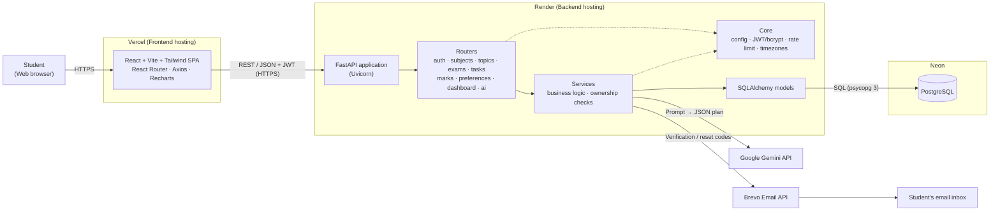

### 3.3 Data Flow Diagrams

#### 3.3.1 Level 0 DFD (Context Diagram)

The whole system is a single process. The student supplies account details, academic data and plan
requests and receives dashboards, plans and confirmations. Gemini receives a prompt and returns a plan;
Brevo receives email requests and delivers codes to the student.

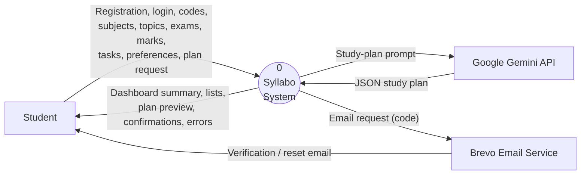

#### 3.3.2 Level 1 DFD

The system is split into its main processes and the data stores (database tables) each one reads or
writes.

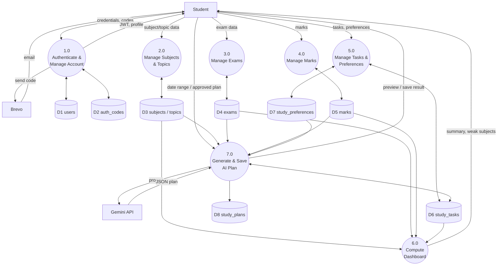

#### 3.3.3 Level 2 DFD — AI Study Plan Generation (process 7.0)

Process 7.0 is broken into its sub-steps, following `plan_service.py`.

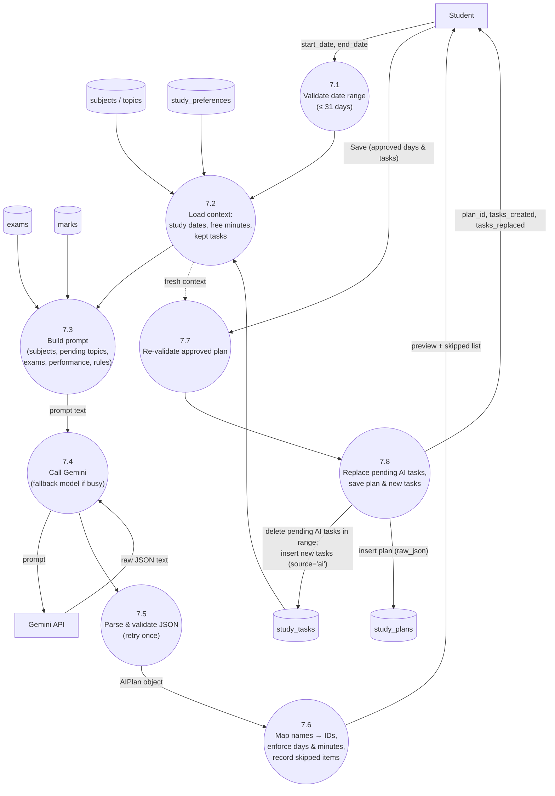

### 3.4 UML Diagrams

#### 3.4.1 Use Case Diagram

Mermaid has no dedicated use-case diagram, so a flowchart is used. Actors are drawn as rectangles and use
cases as rounded shapes.

**Actors:**
- **Visitor** (not logged in), **Student** (logged in, verified)
- **Google Gemini API** (external system), **Brevo Email Service** (external system)

**Use cases:** Register · Verify Email · Resend Code · Log In · Forgot/Reset Password · Log Out · Update
Profile · Change Password · Manage Subjects · Manage Topics · Manage Exams · Record Marks · Manage Study
Tasks · Mark Task Complete · Set Study Preferences · View Dashboard · View Performance · Generate AI Plan ·
Review & Save AI Plan.

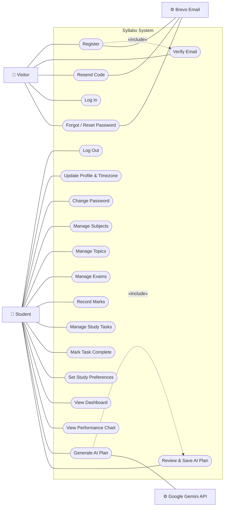

#### 3.4.2 Class Diagram

This diagram is drawn from the real SQLAlchemy models in `backend/app/models/`. `percentage` and
`subject_name` are computed properties, not stored columns.

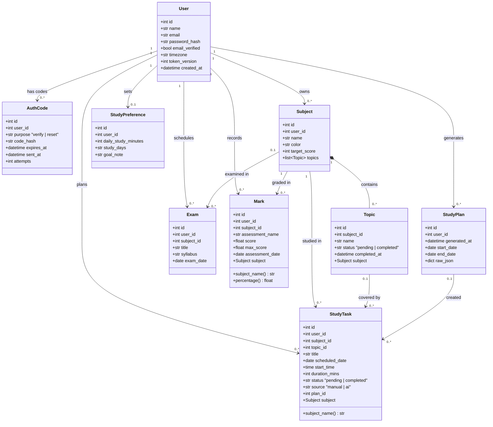

#### 3.4.3 Sequence Diagrams

**(a) Login**

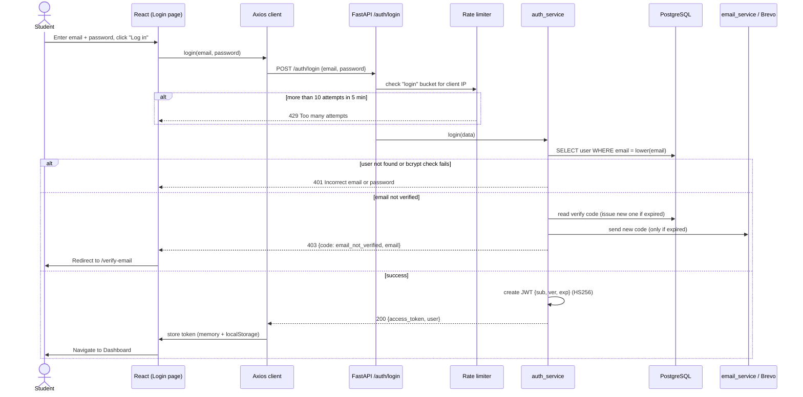

**(b) AI plan generation, preview and save**

```mermaid
sequenceDiagram
    actor S as Student
    participant M as GeneratePlanModal
    participant API as FastAPI /ai
    participant PS as plan_service
    participant DB as PostgreSQL
    participant GS as gemini_service
    participant G as Google Gemini

    S->>M: Choose From/To dates, click "Generate"
    M->>API: POST /ai/generate-plan {start_date, end_date} + JWT
    API->>API: Validate JWT and range (≤ 31 days)
    API->>PS: generate_preview(user, range)
    PS->>DB: Load preferences, subjects+topics, tasks in range
    PS->>PS: Compute study dates & free minutes per day
    alt no subjects / no free time
        PS-->>M: 422 with explanation
    end
    PS->>DB: Load upcoming exams, marks (performance)
    PS->>PS: build_prompt(...)
    PS->>GS: generate_json(prompt)
    GS->>G: generate_content(model, JSON mime, temperature 0.4)
    alt main model busy (429/503) and fallback set
        GS->>G: retry with fallback model
    end
    G-->>GS: JSON text
    GS-->>PS: raw text
    PS->>PS: parse + validate (AIPlan); retry Gemini once if invalid
    PS->>PS: map subject/topic names → IDs, enforce study days & minutes, collect skipped
    PS-->>M: 200 PlanPreview {days, skipped, replaces_pending_ai_tasks}
    M->>S: Show preview (Save / Regenerate / Cancel)
    S->>M: Click "Save plan"
    M->>API: POST /ai/save-plan {start_date, end_date, days}
    API->>PS: save_plan(user, data)
    PS->>DB: Reload context; re-validate ownership, days, minutes
    PS->>DB: DELETE pending AI tasks in range
    PS->>DB: INSERT study_plans (raw_json)
    PS->>DB: INSERT study_tasks (source='ai', plan_id)
    PS-->>M: {plan_id, tasks_created, tasks_replaced}
    M->>S: Toast "AI plan saved — N task(s) added"; task list reloads
```

#### 3.4.4 Activity Diagram — Full Student Journey

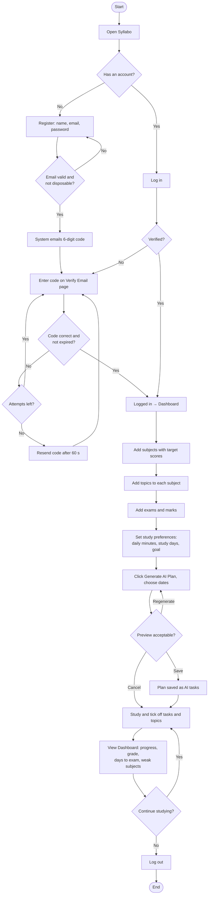

#### 3.4.5 Collaboration (Communication) Diagram

A collaboration diagram shows the objects that work together for one scenario and numbers the messages
between them. Scenario: **the student ticks a task as complete on the Dashboard.**

1. The **Student** clicks the checkbox on a `TaskItem`.
2. `TaskItem` calls `useTaskToggle.toggle(task)`.
3. `useTaskToggle` updates the local task list immediately (optimistic update).
4. `useTaskToggle` asks the **Axios client** to send `PATCH /tasks/{id}/status`.
5. The Axios interceptor adds `Authorization: Bearer <JWT>`.
6. The **tasks router** asks `get_current_user` (security) to decode the JWT and load the `User`.
7. The router calls `task_service.set_status`.
8. `task_service` calls `ownership.get_owned` to load the task and confirm it belongs to the user.
9. `task_service` updates the status and commits it to the **database**.
10. The router returns the updated task (`TaskOut`).
11. `useTaskToggle` calls `summary.reload()`; the **dashboard router** and `dashboard_service` recalculate
    the summary.
12. The Dashboard re-renders the stat cards with the new "completed" count. If step 9 had failed, step 3
    would be undone and an error toast shown.

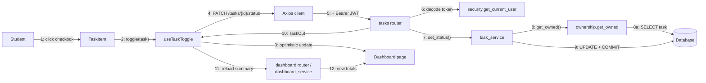

#### 3.4.6 Object Diagram

These sample objects match the demo data in `backend/app/seed.py`. The demo password is stored only as a
bcrypt hash, so no real hash is shown here.

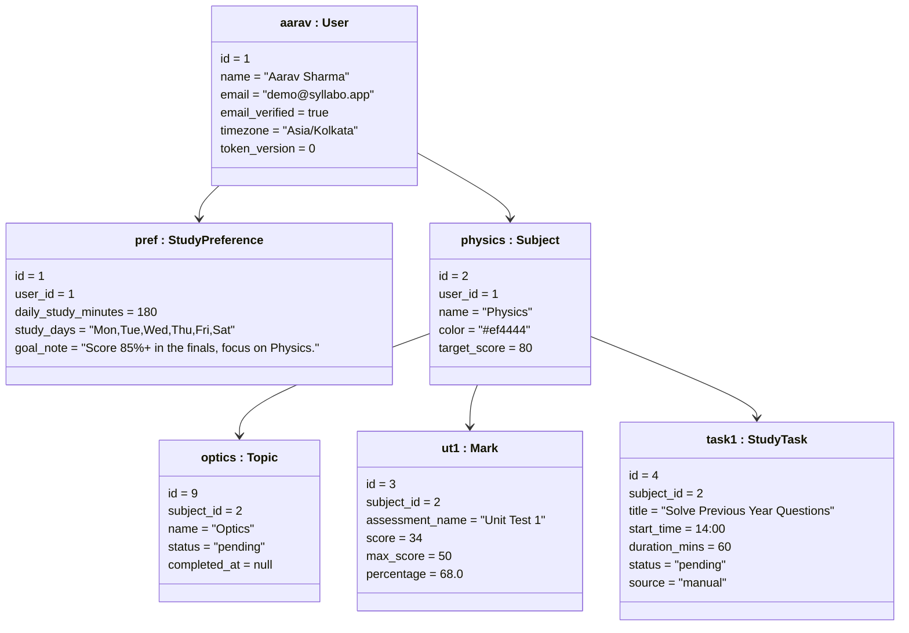

*Interpretation:* Physics has marks of 34/50 (68%) and 15/20 (75%), an average of 71.5%. This is below the
target of 80%, so Physics appears in `weak_subjects` and is marked "WEAK – needs more time" in the AI
prompt. (IDs are examples; real IDs depend on insertion order.)

### 3.5 Database Design

#### 3.5.1 ER Diagram

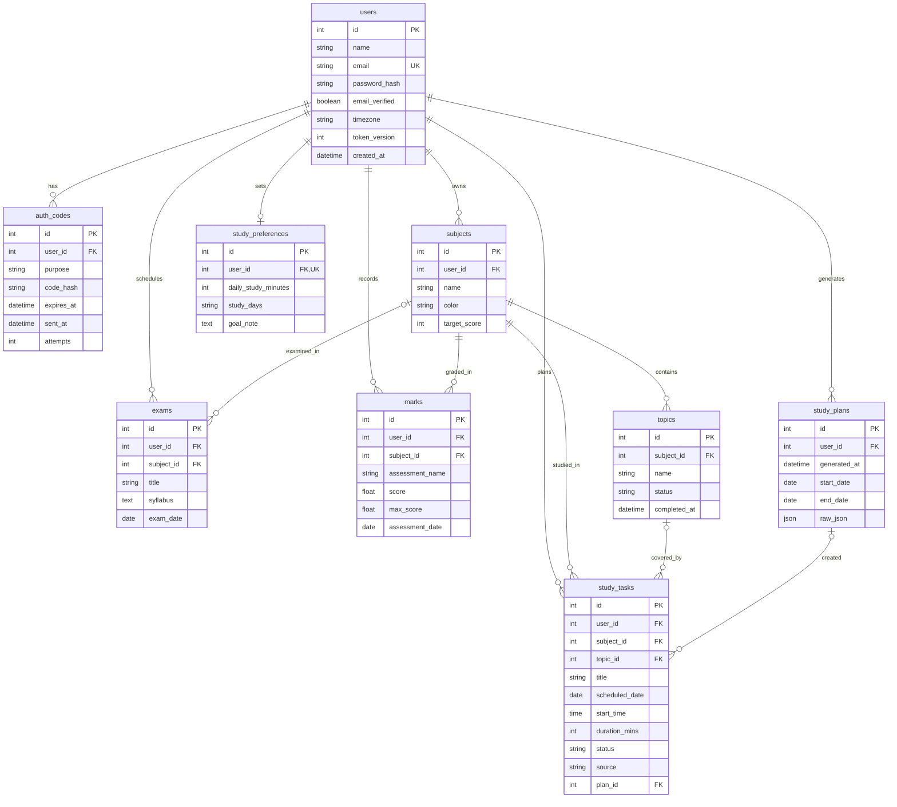

#### 3.5.2 Database Tables

There are 9 application tables. Alembic also creates its own `alembic_version` table to track which
migrations have run. "Default" means the default value set by the application (SQLAlchemy). Values marked
*(server)* are also set by the database itself. All timestamps are stored with a timezone, in UTC.
Foreign-key delete rules: **CASCADE** means the row is deleted with its parent; **SET NULL** means the link
is cleared.

**Table 1: `users`**

| Column | Data type | Constraints | Description |
| --- | --- | --- | --- |
| id | INTEGER | PK, auto-increment | Unique user ID |
| name | VARCHAR(120) | NOT NULL | Full name |
| email | VARCHAR(255) | NOT NULL, UNIQUE, indexed | Login email (stored lowercase) |
| password_hash | VARCHAR(255) | NOT NULL | bcrypt hash of the password |
| email_verified | BOOLEAN | NOT NULL, default FALSE *(server)* | Whether the email code was confirmed |
| timezone | VARCHAR(64) | NOT NULL, default 'UTC' *(server)* | IANA timezone that decides "today" |
| token_version | INTEGER | NOT NULL, default 0 *(server)* | Increased on password change/reset to invalidate old tokens |
| created_at | TIMESTAMP WITH TIME ZONE | NOT NULL, default now (UTC) | Account creation time |

**Table 2: `auth_codes`**

| Column | Data type | Constraints | Description |
| --- | --- | --- | --- |
| id | INTEGER | PK | Code record ID |
| user_id | INTEGER | NOT NULL, FK → users.id (CASCADE), indexed | Owner |
| purpose | VARCHAR(20) | NOT NULL; UNIQUE together with user_id | 'verify' or 'reset' |
| code_hash | VARCHAR(64) | NOT NULL | HMAC-SHA256 of the 6-digit code |
| expires_at | TIMESTAMP WITH TIME ZONE | NOT NULL | Expiry (10 minutes after sending) |
| sent_at | TIMESTAMP WITH TIME ZONE | NOT NULL | When the code was sent (for the 60-second cooldown) |
| attempts | INTEGER | NOT NULL, default 0 | Wrong attempts so far (maximum 5) |

**Table 3: `subjects`**

| Column | Data type | Constraints | Description |
| --- | --- | --- | --- |
| id | INTEGER | PK | Subject ID |
| user_id | INTEGER | NOT NULL, FK → users.id (CASCADE), indexed | Owner |
| name | VARCHAR(120) | NOT NULL | Subject name |
| color | VARCHAR(20) | NOT NULL, default '#2563eb' | Display colour (hex) |
| target_score | INTEGER | NOT NULL, default 75, CHECK 0–100 (`ck_subject_target`) | Target average percentage |

**Table 4: `topics`**

| Column | Data type | Constraints | Description |
| --- | --- | --- | --- |
| id | INTEGER | PK | Topic ID |
| subject_id | INTEGER | NOT NULL, FK → subjects.id (CASCADE), indexed | Parent subject |
| name | VARCHAR(200) | NOT NULL | Topic name |
| status | VARCHAR(20) | NOT NULL, default 'pending' | 'pending' or 'completed' |
| completed_at | TIMESTAMP WITH TIME ZONE | NULL | When it was completed (cleared if set back to pending) |

**Table 5: `exams`**

| Column | Data type | Constraints | Description |
| --- | --- | --- | --- |
| id | INTEGER | PK | Exam ID |
| user_id | INTEGER | NOT NULL, FK → users.id (CASCADE), indexed | Owner |
| subject_id | INTEGER | NULL, FK → subjects.id (SET NULL), indexed | Related subject (optional) |
| title | VARCHAR(200) | NOT NULL | Exam title |
| syllabus | TEXT | NOT NULL, default '' | Syllabus notes |
| exam_date | DATE | NOT NULL, indexed | Exam date |

**Table 6: `marks`**

| Column | Data type | Constraints | Description |
| --- | --- | --- | --- |
| id | INTEGER | PK | Mark ID |
| user_id | INTEGER | NOT NULL, FK → users.id (CASCADE), indexed | Owner |
| subject_id | INTEGER | NOT NULL, FK → subjects.id (CASCADE), indexed | Subject |
| assessment_name | VARCHAR(200) | NOT NULL | e.g. "Unit Test 1" |
| score | DOUBLE PRECISION | NOT NULL (API: ≥ 0 and ≤ max_score) | Marks obtained |
| max_score | DOUBLE PRECISION | NOT NULL (API: > 0) | Maximum marks |
| assessment_date | DATE | NOT NULL | Date of assessment |

**Table 7: `study_preferences`**

| Column | Data type | Constraints | Description |
| --- | --- | --- | --- |
| id | INTEGER | PK | Preference ID |
| user_id | INTEGER | NOT NULL, UNIQUE, FK → users.id (CASCADE) | Owner (one row per user) |
| daily_study_minutes | INTEGER | NOT NULL, default 120 (API: 15–960) | Daily study time limit |
| study_days | VARCHAR(50) | NOT NULL, default 'Mon,Tue,Wed,Thu,Fri,Sat' | Comma-separated study days |
| goal_note | TEXT | NOT NULL, default '' | Student's goal |

**Table 8: `study_tasks`**

| Column | Data type | Constraints | Description |
| --- | --- | --- | --- |
| id | INTEGER | PK | Task ID |
| user_id | INTEGER | NOT NULL, FK → users.id (CASCADE), indexed | Owner |
| subject_id | INTEGER | NOT NULL, FK → subjects.id (CASCADE), indexed | Subject |
| topic_id | INTEGER | NULL, FK → topics.id (SET NULL) | Optional topic |
| title | VARCHAR(200) | NOT NULL | Task title |
| scheduled_date | DATE | NOT NULL, indexed | Day of the task |
| start_time | TIME | NULL | Optional start time |
| duration_mins | INTEGER | NOT NULL, default 60 (API: 5–960) | Duration in minutes |
| status | VARCHAR(20) | NOT NULL, default 'pending' | 'pending' or 'completed' |
| source | VARCHAR(20) | NOT NULL, default 'manual' | 'manual' or 'ai' |
| plan_id | INTEGER | NULL, FK → study_plans.id (SET NULL), indexed | AI plan that created it |

**Table 9: `study_plans`**

| Column | Data type | Constraints | Description |
| --- | --- | --- | --- |
| id | INTEGER | PK | Plan ID |
| user_id | INTEGER | NOT NULL, FK → users.id (CASCADE), indexed | Owner |
| generated_at | TIMESTAMP WITH TIME ZONE | NOT NULL, default now (UTC) | When the plan was saved |
| start_date | DATE | NOT NULL | Plan start |
| end_date | DATE | NOT NULL | Plan end |
| raw_json | JSON | NOT NULL | The approved plan exactly as saved |

**Migration history (`backend/alembic/versions/`):**

1. `a1ba077a6ba2_initial_schema`: creates users, subjects, topics, exams, marks, study_preferences,
   study_tasks and study_plans.
2. `0ea42fef306c_email_verification`: adds `users.email_verified` and an `email_verifications` table, and
   marks existing users as verified.
3. `02845e7c1202_auth_codes_timezone_token_version`: replaces `email_verifications` with the more general
   `auth_codes` table (verify and reset), and adds `users.timezone` and `users.token_version`.

#### 3.5.3 Sample SQL Statements

These PostgreSQL statements are equivalent to what the application does through SQLAlchemy. Values in
`:name` form are parameters.

```sql
-- 1. Register a new user (password already hashed with bcrypt by the application)
INSERT INTO users (name, email, password_hash, email_verified, timezone, token_version, created_at)
VALUES ('Aarav Sharma', 'aarav@example.com', :bcrypt_hash, FALSE, 'Asia/Kolkata', 0, NOW())
RETURNING id;

-- 2. Mark the user's email as verified after a correct code
UPDATE users SET email_verified = TRUE WHERE id = :user_id;
DELETE FROM auth_codes WHERE user_id = :user_id AND purpose = 'verify';

-- 3. Add a subject and a topic
INSERT INTO subjects (user_id, name, color, target_score)
VALUES (:user_id, 'Physics', '#ef4444', 80) RETURNING id;

INSERT INTO topics (subject_id, name, status) VALUES (:subject_id, 'Optics', 'pending');

-- 4. Mark a topic completed (only if it belongs to the user)
UPDATE topics t SET status = 'completed', completed_at = NOW()
FROM subjects s
WHERE t.subject_id = s.id AND t.id = :topic_id AND s.user_id = :user_id;

-- 5. Fetch today's tasks (today = date in the user's timezone)
SELECT st.id, st.title, s.name AS subject_name, st.start_time, st.duration_mins, st.status, st.source
FROM study_tasks st
JOIN subjects s ON s.id = st.subject_id
WHERE st.user_id = :user_id AND st.scheduled_date = :today
ORDER BY st.start_time, st.id;

-- 6. Upcoming exams, nearest first
SELECT id, title, subject_id, syllabus, exam_date, (exam_date - :today) AS days_left
FROM exams
WHERE user_id = :user_id AND exam_date >= :today
ORDER BY exam_date, id;

-- 7. Average mark percentage per subject (performance chart)
SELECT s.id, s.name, s.target_score,
       ROUND(AVG(m.score / m.max_score * 100)::numeric, 1) AS avg_percentage
FROM subjects s
LEFT JOIN marks m ON m.subject_id = s.id
WHERE s.user_id = :user_id
GROUP BY s.id, s.name, s.target_score
ORDER BY s.name;

-- 8. Weak subjects (average below target)
SELECT s.name, s.target_score, ROUND(AVG(m.score / m.max_score * 100)::numeric, 1) AS avg_percentage
FROM subjects s
JOIN marks m ON m.subject_id = s.id
WHERE s.user_id = :user_id
GROUP BY s.id, s.name, s.target_score
HAVING AVG(m.score / m.max_score * 100) < s.target_score;

-- 9. Overall syllabus progress and change in the last 7 days
SELECT ROUND(100.0 * COUNT(*) FILTER (WHERE t.status = 'completed') / NULLIF(COUNT(*), 0), 1) AS overall_progress,
       ROUND(100.0 * COUNT(*) FILTER (WHERE t.status = 'completed'
                                       AND t.completed_at >= NOW() - INTERVAL '7 days')
             / NULLIF(COUNT(*), 0), 1) AS progress_change_this_week
FROM topics t
JOIN subjects s ON s.id = t.subject_id
WHERE s.user_id = :user_id;

-- 10. Current grade from the average of all marks
SELECT CASE
         WHEN AVG(score / max_score * 100) IS NULL THEN NULL
         WHEN AVG(score / max_score * 100) >= 80 THEN 'A'
         WHEN AVG(score / max_score * 100) >= 65 THEN 'B'
         WHEN AVG(score / max_score * 100) >= 50 THEN 'C'
         WHEN AVG(score / max_score * 100) >= 35 THEN 'D'
         ELSE 'F'
       END AS current_grade
FROM marks WHERE user_id = :user_id;

-- 11. Saving an AI plan: remove only pending AI tasks in the range, then insert the new plan and tasks
BEGIN;
DELETE FROM study_tasks
WHERE user_id = :user_id AND source = 'ai' AND status = 'pending'
  AND scheduled_date BETWEEN :start_date AND :end_date;

INSERT INTO study_plans (user_id, generated_at, start_date, end_date, raw_json)
VALUES (:user_id, NOW(), :start_date, :end_date, :plan_json) RETURNING id;

INSERT INTO study_tasks (user_id, subject_id, topic_id, title, scheduled_date, start_time,
                         duration_mins, status, source, plan_id)
VALUES (:user_id, :subject_id, :topic_id, 'Practice Optics numericals', :date, '09:00', 60,
        'pending', 'ai', :plan_id);
COMMIT;
```

---

## 4. Testing

### 4.1 Testing Approach

Testing combines:

- **Automated API tests (backend)**: realistic HTTP requests are sent to the FastAPI app through
  `TestClient`. Each test gets a fresh in-memory SQLite database. These are black-box tests at the API
  level and also integration tests (router → service → ORM → database).
- **Unit and white-box tests**: individual functions and branches are checked, for example the CORS parser,
  production setting checks, Gemini fallback logic, email request shape and date utilities.
- **Mocking of external services**: Gemini (`generate_json` / `_generate`) and email (`send_code`, or the
  `httpx.post` call to Brevo) are replaced with test doubles. Tests therefore never spend API quota or send
  real email, and the AI's behaviour can be controlled exactly.
- **Frontend component tests**: React components and pages are rendered in a simulated browser (jsdom),
  user actions are simulated, and the API is mocked.
- **Manual testing**: deployed-system testing in a browser. **TO BE FILLED BY WRITER** with any manual test
  sessions performed (dates, browsers and devices used).

### 4.2 Testing Tools and Environment

| Tool | Version | Use |
| --- | --- | --- |
| pytest | 9.1.1 | Backend test runner (fixtures, parametrised tests, `monkeypatch`) |
| FastAPI TestClient (httpx 0.28.1) | — | Sends HTTP requests to the app in-process |
| SQLite (in-memory, StaticPool) | — | Isolated test database; optional PostgreSQL via `TEST_DATABASE_URL` |
| Vitest | 2.1.9 | Frontend test runner |
| jsdom | 25.0.1 | Simulated browser DOM |
| @testing-library/react | 16.3.3 | Rendering and querying components |
| @testing-library/user-event | 14.6.7 | Simulating typing and clicks |
| @testing-library/jest-dom | 6.9.1 | DOM assertions (`toBeInTheDocument`, etc.) |

Test environment: Linux, Python 3.12.3, Node.js 18.19.1. Commands: `cd backend && pytest` and
`cd frontend && npm test`.

Test set-up (`backend/tests/conftest.py`): an automatic fixture captures emailed codes in memory, turns off
the DNS deliverability check and raises the rate limit (so tests are not blocked). A `register()` helper
registers and verifies a user and returns the auth headers.

### 4.3 Black Box Testing

The "Actual result" and "Status" columns come from the automated test run on 2026-10-07. The test that
covers each case is given in brackets.

| ID | Scenario | Input | Expected output | Actual result | Status |
| --- | --- | --- | --- | --- | --- |
| TC01 | Register new user | name, gmail.com address, password "secret123" | 201; code emailed; **no** token returned | As expected (`test_register_sends_code_and_returns_no_token`) | Pass |
| TC02 | Verify email with correct code | email + emailed code | 200; JWT + user; login works | As expected (`test_register_login_and_me`) | Pass |
| TC03 | Login before verifying | correct credentials, unverified | 403 `email_not_verified` | As expected (`test_login_blocked_until_verified`) | Pass |
| TC04 | Wrong verification code | wrong 6-digit code ×5 | 400 with attempts left; then 429 | As expected (`test_wrong_code_attempts_are_limited`) | Pass |
| TC05 | Expired code | code after expiry | 400 "code has expired" | As expected (`test_expired_code_rejected`) | Pass |
| TC06 | Resend code too soon | resend within 60 s | 429 "Please wait…" | As expected (`test_resend_cooldown_and_new_code`) | Pass |
| TC07 | Disposable email | x@mailinator.com, x@yopmail.com, x@sub.guerrillamail.com | 422 | As expected (`test_disposable_domains_rejected` ×3) | Pass |
| TC08 | Undeliverable domain | domain with no mail server | 422 | As expected (`test_undeliverable_domain_rejected`) | Pass |
| TC09 | Duplicate email | same email registered twice | 409 | As expected (`test_duplicate_email_rejected`) | Pass |
| TC10 | Wrong password | correct email, wrong password | 401 | As expected (`test_wrong_password`) | Pass |
| TC11 | Invalid registration data | empty name, "bad" email, password "1" | 422 | As expected (`test_validation_error`) | Pass |
| TC12 | Access without token | GET /auth/me, /subjects; bad token on /dashboard/summary | 401 | As expected (`test_protected_routes_require_token`) | Pass |
| TC13 | Login rate limit | repeated login attempts above the limit | 429 | As expected (`test_login_rate_limited`) | Pass |
| TC14 | Forgot + reset password | email, code, new password | 200; new password works; old token rejected | As expected (`test_forgot_and_reset_password`) | Pass |
| TC15 | Forgot password, unknown email | unregistered email | Same generic reply (no leak) | As expected (`test_forgot_password_does_not_reveal_accounts`) | Pass |
| TC16 | Change password and profile | current + new password; new name | Profile saved; other sessions logged out | As expected (`test_profile_update_and_change_password`) | Pass |
| TC17 | Subject & topic CRUD | create subject, 2 topics, toggle, rename, delete | 201/200/204; cascade removes tasks & marks | As expected (`test_subject_topic_crud_and_dashboard`) | Pass |
| TC18 | Dashboard calculations | 2 topics (1 done), exam in 10 days, 1 task today, mark 14/20 | progress 50%, days 10, grade B, Physics weak | As expected (`test_subject_topic_crud_and_dashboard`) | Pass |
| TC19 | Complete a task | PATCH status "completed" | today_tasks_completed increases to 1 | As expected (`test_subject_topic_crud_and_dashboard`) | Pass |
| TC20 | Edit task and mark | PATCH task fields; PATCH mark | Values updated; validation enforced | As expected (`test_edit_task_and_mark`) | Pass |
| TC21 | Data isolation | user B accesses user A's subject/topic/mark | 404 / empty list | As expected (`test_users_cannot_see_each_others_data`) | Pass |
| TC22 | "Today" follows user timezone | user with a non-UTC timezone | Today's tasks use that zone's date | As expected (`test_today_follows_user_timezone`) | Pass |
| TC23 | AI plan preview rules | mocked Gemini plan with bad subject/topic, over-limit task, non-study day | Valid tasks mapped; 4 kinds of items skipped with reasons | As expected (`test_generate_preview_maps_and_enforces_rules`) | Pass |
| TC24 | AI returns invalid JSON | "not json" then a valid plan / two invalid answers | Retry once → 200; two failures → 502 | As expected (`test_invalid_response_retries_once_then_errors`) | Pass |
| TC25 | AI rate-limited | Gemini busy | 429 with friendly message | As expected (`test_rate_limit_is_friendly`) | Pass |
| TC26 | AI not configured | no GEMINI_API_KEY | 503 | As expected (`test_not_configured_returns_503`) | Pass |
| TC27 | Save AI plan twice | manual task + AI tasks, one completed, then regenerate | Only the pending AI task is replaced | As expected (`test_save_replaces_only_pending_ai_tasks`) | Pass |
| TC28 | Save tampered plan | 121 min on a 120-min day; another user's subject | 422; 404 | As expected (`test_save_rejects_overbooked_day_and_foreign_subject`) | Pass |
| TC29 | Frontend: unverified login | Login page, API returns 403 | Redirect to Verify Email page | As expected (`auth.test.jsx`) | Pass |
| TC30 | Frontend: forgot/reset flow | email → code + new password | Code requested, password reset, session stored | As expected (`auth.test.jsx`) | Pass |

### 4.4 White Box Testing

These are the internal functions and logic paths covered by tests:

- **Grade calculation (`dashboard_service.grade_for`)**: covered through the dashboard test (70% → "B").
  The `None` path (no marks → no grade) is in the code and is shown on the dashboard as "—". *Note:* there
  is no separate unit test for each grade boundary (A/C/D/F); the writer may list this as a test gap.
- **Progress and weak-subject detection (`dashboard_service.summary`, `subject_performance`)**: the test
  checks the completed ÷ total ratio, the 7-day window, days to the next exam, and the weak-subject branch
  `avg_percentage < target_score`. Subjects without marks are excluded from weak subjects.
- **Plan mapping and validation (`plan_service._map_plan`)**: every skip branch is exercised: date not a
  study day, unknown subject, unknown topic, and task exceeding remaining minutes. The happy paths covered
  are case-insensitive subject matching and an empty topic (general revision).
- **AI response parsing and retry (`plan_service._request_plan`, `_parse_plan`)**: invalid JSON leads to a
  retry; valid JSON on the second attempt succeeds; two failures lead to 502. Error translation:
  `AIRateLimitError` → 429, `AINotConfiguredError` → 503.
- **Save validation (`plan_service._validate_for_save`, `save_plan`)**: the over-limit branch (422), the
  foreign-subject branch (404), and the replace filter (`source='ai' AND status='pending' AND date in
  range`).
- **Gemini fallback (`gemini_service.generate_json`)**: main model 503 → fallback succeeds; both models
  busy (429) → `AIRateLimitError`.
- **Verification-code logic (`auth_service._issue_code`, `_consume_code`, `_cooldown_left`)**: correct code,
  wrong code with attempts left, attempts exhausted, expired code, cooldown, and a fresh code issued on
  login when the old one expired.
- **Password reset (`auth_service.reset_password`)**: `token_version` increases (old token rejected), and
  an unverified account becomes verified (`test_reset_verifies_unverified_account`).
- **Email service (`email_service.send_code`, `_send_brevo`)**: the Brevo request (URL, `api-key` header,
  sender, recipient, subject containing the code); an HTTP error from Brevo → `EmailSendError`; console
  mode prints the code.
- **Email validation (`email_validation.validate_real_email`)**: the disposable-domain branch, including
  sub-domains, and the undeliverable-domain branch.
- **Configuration (`Settings.cors_origin_list`, `production_problems`)**: four ways of pasting CORS
  origins (commas, quotes and trailing slash, new lines, semicolons), and detection of unsafe production
  settings.
- **Rate limiter (`rate_limit.rate_limit`)**: the over-limit branch → 429.
- **Frontend utilities**: `toISODate` in the active timezone, `addDaysISO` across month ends, `greeting`
  by hour, `formatTime`, `formatDuration`. `errorMessage` handles string, object and validation-list
  error details and network errors. `isEmailNotVerified`.
- **Frontend component (`TaskItem`)**: renders details and the "AI" badge; calls the toggle, edit and
  delete handlers.

### 4.5 Integration Testing

| Flow | How it is verified |
| --- | --- |
| Backend ↔ Database | All API tests run the real router → service → SQLAlchemy → SQLite path with foreign keys on, including cascade deletes (deleting a subject removes its tasks and marks). The same suite can run against PostgreSQL by setting `TEST_DATABASE_URL`. |
| Backend ↔ Gemini | The integration point `gemini_service.generate_json` is replaced with scripted answers, so the whole chain (prompt building, parsing, retry, mapping, preview) is tested end to end without network calls. The fallback-model test mocks the lower-level `_generate` call. **Live Gemini calls are not part of the automated suite.** |
| Backend ↔ Brevo | The outgoing HTTP call (`httpx.post`) is intercepted to check the exact request sent to Brevo, and an error response is simulated. **Live email delivery is not part of the automated suite.** |
| Frontend ↔ Backend | Frontend tests mock the Axios API client and check that pages call the right endpoints and react to their responses (redirects, stored session, error messages). There are **no automated end-to-end browser tests** (for example Playwright or Cypress) against a running backend. |
| Full system (deployed) | **TO BE FILLED BY WRITER**: results of manual testing on the deployed Vercel + Render + Neon system (registration with a real email, AI plan generation with a real Gemini key, and so on). |

### 4.6 Test Analysis and Results

The tests were run on **2026-10-07** on the development machine.

**Backend (pytest):**

```
platform linux -- Python 3.12.3, pytest-9.1.1, pluggy-1.6.0
collected 40 items

tests/test_account.py ............. (13)
tests/test_ai_plan.py .......       (7)
tests/test_auth.py .....            (5)
tests/test_email_service.py ...     (3)
tests/test_email_verification.py .......... (10)
tests/test_subjects_flow.py ..      (2)

======================== 40 passed, 1 warning in 14.88s ========================
```

(The single warning is a deprecation notice from the Starlette test client about `httpx`; it does not
affect the results.)

**Frontend (Vitest):**

```
 ✓ src/utils/date.test.js (4 tests)
 ✓ src/api/client.test.js (3 tests)
 ✓ src/components/TaskItem.test.jsx (2 tests)
 ✓ src/pages/auth.test.jsx (4 tests)

 Test Files  4 passed (4)
      Tests  13 passed (13)
```

(Two React Router "future flag" warnings are printed; they are informational only.)

**Summary:**

| Suite | Total | Passed | Failed |
| --- | --- | --- | --- |
| Backend | 40 | 40 | 0 |
| Frontend | 13 | 13 | 0 |
| **Total** | **53** | **53** | **0** |

**Analysis:** all automated tests pass. Coverage is strongest for authentication, security rules,
data isolation and AI plan validation, which are the riskiest parts of the system. Gaps: there are no
frontend tests for the Dashboard, Subjects, Performance, Study Plan or Settings pages, no end-to-end
browser tests, no separate unit tests for each grade boundary, and no code-coverage percentage is
measured (no coverage tool is configured).

---

## 5. Implementation and UI

### 5.1 Introduction

Syllabo was built in phases (from the git history): backend foundation, frontend core, AI study plan
generation, email verification, deployment preparation, and finally removal of out-of-scope pages and the
rename from "StudyAI" to "Syllabo". This chapter describes how each part is implemented and what each
screen offers.

### 5.2 Technology Implementation

#### 5.2.1 Frontend Implementation

- **React 18 + Vite 5:** a single-page application. The entry point is `src/main.jsx`, which wraps the app
  in `BrowserRouter`, `ToastProvider` and `AuthProvider`.
- **Routing (React Router 6, `src/App.jsx`):**
  - Public: `/login`, `/register`, `/verify-email`, `/forgot-password`.
  - Protected (inside `ProtectedRoute` + `Layout`): `/` (Dashboard), `/study-plan`, `/subjects`,
    `/performance`, `/settings`.
  - Any unknown path redirects to `/`. `vercel.json` sends every path to `index.html` so deep links work.
- **Authentication handling:**
  - `src/api/client.js` creates an Axios instance with `baseURL = VITE_API_URL`. The JWT is kept in memory
    and in `localStorage` (key `studyai_token`). A request interceptor adds the `Bearer` header.
  - A response interceptor logs the user out automatically on any 401 from a protected endpoint.
  - `AuthContext` loads `/auth/me` on start-up if a token exists and offers `login`, `register`,
    `verifyEmail`, `resetPassword`, `logout` and `setSession`. It also sets the active timezone for date
    display.
  - `ProtectedRoute` shows a loader while checking, and sends users who are not logged in to `/login`
    (remembering where they came from).
- **Data fetching:** the `useApi(path)` hook handles loading, error and reload; `useTaskToggle` handles
  optimistic task completion with rollback.
- **Styling:** Tailwind CSS 3 with a custom theme (blue primary colour `#2563eb`, `canvas` background
  `#f5f7fb`, Inter font, card shadow). Shared components are in `components/ui.jsx`: Spinner,
  LoadingBlock, EmptyState, CardHeader, PageHeader, Modal, ConfirmDialog, Checkbox and SubjectDot. Icons
  come from `lucide-react`.
- **Charts:** `PerformanceChart.jsx` uses Recharts to draw grouped bars (average marks in blue, target in
  amber) on a 0–100 scale, with a tooltip and value labels. Subject names are shortened on narrow screens.
- **Responsiveness:** a fixed sidebar on large screens and a slide-out drawer with a hamburger menu on
  mobile.
- **Dates:** `utils/date.js` formats all dates in the user's saved timezone, so "today" matches the
  backend.

#### 5.2.2 Backend Implementation

- **FastAPI application (`app/main.py`):** registers the nine routers (auth, subjects, topics, exams,
  preferences, tasks, marks, dashboard, ai), CORS middleware, a global exception handler and `/health`. A
  start-up (lifespan) hook runs production safety checks and logs the allowed CORS origins.
- **Structure:**
  - `routers/`: thin HTTP layer that declares dependencies (`get_db`, `get_current_user`,
    `rate_limit(...)`) and response models.
  - `schemas/`: Pydantic v2 models with validation rules (lengths, ranges, regex for colours and codes,
    cross-field rules such as `score ≤ max_score` and `end_date ≥ start_date`).
  - `services/`: all business logic. `ownership.get_owned()` loads any record and returns 404 if it is
    not the user's.
  - `models/`: SQLAlchemy 2 typed models (`Mapped[...]`).
  - `core/`: settings (`pydantic-settings`), database engine/session, security, rate limiting,
    timezones.
- **JWT:** `create_access_token` signs `{sub: user_id, ver: token_version, exp}` with HS256 using
  `JWT_SECRET`. `get_current_user` checks the signature and expiry, that the user exists, and that the
  token version matches.
- **Validation and errors:** invalid input → 422 (FastAPI/Pydantic); not found or not owned → 404;
  authentication → 401/403; conflicts → 409; rate limits → 429; AI problems → 502/503.
- **Seed script:** `python -m app.seed` resets and creates the demo user `demo@syllabo.app` with 5
  subjects, 20 topics, 4 exams (3 upcoming, 1 past), 10 marks, 8 tasks and preferences.

#### 5.2.3 Database Implementation

- **PostgreSQL on Neon** in production. The `DATABASE_URL` setting is normalised to the `psycopg` (v3)
  driver automatically (`postgres://` and `postgresql://` are both accepted).
- **SQLite fallback:** if `DATABASE_URL` is empty, a local file `backend/studyai.db` is used. Foreign keys
  are switched on per connection with `PRAGMA foreign_keys=ON`.
- **SQLAlchemy 2.1 ORM:** declarative typed models, relationships (`Subject.topics` with cascade delete),
  and loading strategies (`selectinload` for topics, `lazy="joined"` for the subject on marks and tasks).
  Connections are checked before use (`pool_pre_ping=True`).
- **Alembic migrations:** three versioned migrations (see §3.5.2). `alembic/env.py` reads the URL from the
  app settings and uses batch mode so migrations also work on SQLite. On Render, `alembic upgrade head`
  runs before the server starts.

#### 5.2.4 AI Integration (Google Gemini)

1. **Trigger:** only when the user clicks **Generate** in the "Generate AI study plan" dialog (default
   range: today to 6 days ahead). It is never called on page load.
2. **Context gathering (`_load_context`):** preferences; study dates within the range that fall on chosen
   study days; all subjects with topics; existing tasks in the range. Manual and completed tasks are *kept*
   and their minutes subtracted from the daily limit to give the **available minutes per date**. Pending
   AI tasks are counted as replaceable.
3. **Prompt building (`build_prompt`, `PROMPT_TEMPLATE`):** the prompt includes:
   - the required JSON format,
     `{"days":[{"date":"YYYY-MM-DD","tasks":[{"subject","topic","title","start_time":"HH:MM","duration_mins"}]}]}`;
   - the plan period and today's date;
   - allowed study days, the daily limit and the minutes available on each date;
   - the student's goal;
   - subjects with target and pending topics ("use these names exactly");
   - upcoming exams with days remaining, linked subject and syllabus;
   - performance per subject, marked "(WEAK – needs more time)" when below target;
   - tasks already scheduled;
   - **rules:** never exceed available minutes; prioritise nearer exams and weak subjects; use exact names;
     specific titles; no overlapping times between 07:00 and 21:00; durations of 15–120 minutes; leave
     revision for the days before exams.
4. **Gemini call (`gemini_service`):** `client.models.generate_content` with
   `response_mime_type="application/json"`, `temperature=0.4` and automatic function calling turned off.
   The model comes from `GEMINI_MODEL`. If it answers 429/503 (busy) and `GEMINI_FALLBACK_MODEL` is set,
   the fallback is tried once. API errors become user-friendly messages (busy → 429, bad key or unknown
   model → 503, other → 502).
5. **Validation and retry (`_request_plan`, `_parse_plan`):** code fences (```` ``` ````) are removed if
   present, the text is parsed as JSON and validated against the Pydantic `AIPlan` model. If parsing or
   validation fails, Gemini is asked **once more**. A second failure returns 502 with a clear message.
6. **Mapping and rule enforcement (`_map_plan`):** subject and topic names are matched without regard to
   capitals or spaces. A suggestion is **skipped with a reason** if the date is not a study date in range,
   the subject is unknown, the topic is unknown, or it would exceed the remaining minutes for that day.
7. **Preview before save:** the API returns days (tasks, total and available minutes), the skipped list
   and how many pending AI tasks would be replaced. The UI shows these with **Save plan / Regenerate /
   Cancel**.
8. **Save (`save_plan`):** the server reloads the context and **re-validates** the client-sent plan
   (ownership, study days, minute limits), so a modified request cannot overbook a day or use another
   user's subject. In one transaction it deletes pending AI tasks in the range, stores the plan JSON in
   `study_plans` and creates the tasks with `source='ai'` and `plan_id`.

#### 5.2.5 Email Service (Brevo)

- **Provider selection:** `EMAIL_PROVIDER` = `brevo` | `smtp` | `console`.
- **Brevo:** an HTTP POST to `https://api.brevo.com/v3/smtp/email` with the `api-key` header, sender
  (`EMAIL_FROM_NAME`, `EMAIL_FROM`), recipient, subject, text and HTML content, and a 15-second timeout.
  This is used in production because Render's free tier blocks outgoing SMTP (noted in `config.py`).
- **Content:** subject "`<code>` is your Syllabo verification code" or "`<code>` is your Syllabo password
  reset code"; a greeting with the user's name (HTML-escaped); the large code; expiry in minutes; an
  "ignore this email" line.
- **Failure handling:** any provider error is logged and raised as `EmailSendError`. The auth service then
  replies with `email_sent: false` and a message asking the user to use "Resend code".
- **Uses:** email verification after registration, re-sent on login if the old code expired, and password
  reset.

#### 5.2.6 Deployment

| Part | Platform | Configuration in repo |
| --- | --- | --- |
| Frontend | **Vercel** | `frontend/vercel.json` (SPA rewrite to `/index.html`); build `vite build`; env `VITE_API_URL` |
| Backend | **Render** (web service `studyai-api`, free plan, region Ohio) | `render.yaml`: root `backend`, build `pip install -r requirements.txt`, start `alembic upgrade head && uvicorn app.main:app --host 0.0.0.0 --port $PORT --proxy-headers --forwarded-allow-ips='*'`, health check `/health`, Python 3.12.8 |
| Database | **Neon** (serverless PostgreSQL, AWS us-east-2 per the `render.yaml` comment) | Connection string given through `DATABASE_URL` |
| AI | Google Gemini API | `GEMINI_API_KEY`, `GEMINI_MODEL`, `GEMINI_FALLBACK_MODEL` |
| Email | Brevo | `BREVO_API_KEY`, `EMAIL_FROM`, `EMAIL_FROM_NAME` |

**Environment variable names (no values):**

- *Backend:* `ENVIRONMENT`, `DATABASE_URL`, `JWT_SECRET`, `JWT_ALGORITHM`, `JWT_EXPIRE_MINUTES`,
  `CORS_ORIGINS`, `GEMINI_API_KEY`, `GEMINI_MODEL`, `GEMINI_FALLBACK_MODEL`, `EMAIL_PROVIDER`, `EMAIL_FROM`,
  `EMAIL_FROM_NAME`, `BREVO_API_KEY`, `SMTP_HOST`, `SMTP_PORT`, `SMTP_USER`, `SMTP_PASSWORD`,
  `EMAIL_CHECK_DELIVERABILITY`, `AUTH_RATE_LIMIT`, `AUTH_RATE_WINDOW_SECONDS`, `PYTHON_VERSION` (Render).
- *Frontend:* `VITE_API_URL`.
- *Tests (optional):* `TEST_DATABASE_URL`.

When `ENVIRONMENT=production`, the backend refuses to start if `JWT_SECRET` is the default or shorter than
32 characters, `DATABASE_URL` is empty, email is set to `console`, or the provider's credentials are
missing. `render.yaml` makes Render generate `JWT_SECRET` automatically.

Live URLs: **TO BE FILLED BY WRITER**. The project owner mentioned the frontend domain
`syllabo-app.vercel.app`; please confirm it before including it.

### 5.3 User Interface Description

All signed-in pages share the **Layout**: a left sidebar with the Syllabo logo, navigation (Dashboard, My
Study Plan, Subjects, Performance, Settings), and the user's initials, name, email and a logout button at
the bottom. A top bar holds a search box (disabled, "coming soon") and a notifications bell (visual only).
On mobile the sidebar opens from a hamburger button. The browser tab title is "Syllabo — Plan · Learn ·
Grow".

#### 5.3.1 Login Page (`/login`)
- **Purpose:** sign in to an existing account.
- **What the user sees:** a centred card titled "Welcome back" with "Log in to continue your study plan.",
  Email and Password fields, a "Forgot password?" link and a "Create one" link to registration.
- **Actions:** log in; go to Forgot Password; go to Register. Wrong credentials show a red error message.
  An unverified account is redirected to the Verify Email page.
- [SCREENSHOT: Login Page]

#### 5.3.2 Register Page (`/register`)
- **Purpose:** create a new account.
- **What the user sees:** "Create your account" / "Plan smarter, track progress and hit your targets.";
  Full name, Email (hint: "Use your real email — we'll send a code to verify it.") and Password (hint: "At
  least 6 characters.").
- **Actions:** create the account (the browser's timezone is sent automatically) and go to Verify Email;
  link to Log in. Errors such as a disposable or duplicate email are shown in the card.
- [SCREENSHOT: Register Page]

#### 5.3.3 Email Verification Page (`/verify-email`)
- **Purpose:** confirm ownership of the email address.
- **What the user sees:** "Check your email" with the address highlighted, a 6-digit code field
  (numbers only), the hint "The code expires in 10 minutes. Check your spam folder too."
- **Actions:** Verify email (enabled when 6 digits are entered) → logged in and taken to the Dashboard with
  the toast "Email verified — welcome to Syllabo!". "Resend code" with a 60-second countdown. "Register
  again" link.
- [SCREENSHOT: Email Verification Page]

#### 5.3.4 Forgot / Reset Password Page (`/forgot-password`)
- **Purpose:** recover access with an emailed code.
- **What the user sees:** Step 1, "Reset your password", with an email field and "Send reset code". Step
  2, "Choose a new password", with a reset-code field, New password and Confirm new password.
- **Actions:** send the code; reset the password (checks that the two passwords match), which logs the user
  in with the toast "Password updated — you are logged in"; resend the code after 60 seconds; "Back to log
  in".
- [SCREENSHOT: Forgot Password – Step 1]
- [SCREENSHOT: Reset Password – Step 2]

#### 5.3.5 Dashboard (`/`)
- **Purpose:** an at-a-glance summary of the student's situation.
- **What the user sees:**
  - A greeting ("Good Morning/Afternoon/Evening, {first name}! 👋") with today's date.
  - Four stat cards: **Today's Tasks** (x completed), **Days to Exam** (next exam title), **Overall
    Progress** (+x% this week) and **Current Grade** ("Great work!" for A/B, "Keep pushing!" otherwise).
  - **Today's Study Plan** list with checkboxes, subject, duration, start time and an "AI" badge for AI
    tasks.
  - **Performance Overview** bar chart (Marks vs Target).
  - **Upcoming Exams** (next 3, with month/day badges and syllabus).
  - **Recommendations**: "Focus more on {subject}" for each weak subject, with average and target; or "All
    subjects are on target"; or "No recommendations yet" if there are no marks.
- **Actions:** tick tasks complete (stats refresh); "View All" links to My Study Plan and Subjects → Exams;
  a recommendation links to Performance.
- [SCREENSHOT: Dashboard]

#### 5.3.6 Subjects Page (`/subjects`)
- **Purpose:** manage the syllabus and exams.
- **What the user sees:** a grid of subject cards. Each card has a colour dot, name, "Target X% · done/total
  topics done", a coloured progress bar, a topic checklist and an "Add a topic…" field. Below is an
  **Exams** section listing all exams with subject, syllabus and date; past exams are faded.
- **Actions:** Add/Edit subject (modal: name, target score, colour picker); Delete subject (confirmation
  warns that topics, tasks and marks are deleted too); add, tick and delete topics; Add/Edit/Delete exam
  (modal: title, subject or "General", date, syllabus).
- [SCREENSHOT: Subjects Page]
- [SCREENSHOT: Add Subject Modal]
- [SCREENSHOT: Add Exam Modal]

#### 5.3.7 Performance Page (`/performance`)
- **Purpose:** record marks and compare them with targets.
- **What the user sees:** the Performance Overview chart; an "Add marks" form (subject, assessment, score,
  out of, date); a "Past marks" table (date, subject, assessment, score/max, %, edit/delete).
- **Actions:** add a mark; edit a mark (modal); delete a mark (confirmation). The chart and the dashboard
  refresh after each change.
- [SCREENSHOT: Performance Page]

#### 5.3.8 My Study Plan Page (`/study-plan`)
- **Purpose:** view and manage study tasks day by day.
- **What the user sees:** "Add task" and "Generate AI Plan" buttons; a collapsible **Study settings** panel
  (daily minutes, study-day buttons Mon–Sun, goal); "Upcoming" / "All tasks" tabs; one card per day
  ("Today · …", "Tomorrow · …") showing "done/total done · total time" and the tasks.
- **Actions:** add/edit a task (modal: title, subject, optional topic, date, start time, minutes); tick
  complete; delete (confirmation); save study settings; open the AI plan dialog.
- [SCREENSHOT: My Study Plan Page]
- [SCREENSHOT: Add Study Task Modal]

#### 5.3.9 AI Plan Generation and Preview (dialog on My Study Plan)
- **Purpose:** generate and review an AI study plan before saving it.
- **What the user sees:**
  - *Step 1:* "Generate AI study plan", an explanation that the AI uses subjects, pending topics, upcoming
    exams, weak subjects and study settings, and From/To date pickers.
  - *Loading:* a spinner and "Building your personalised plan… this can take a few seconds."
  - *Step 2:* "Review your AI plan", with the summary "N tasks across M study days (limit X min/day)". If
    the plan will replace existing pending AI tasks, an amber warning says so (manual and completed tasks
    are kept). Each day lists planned time and free time, and each task shows time, title, subject, topic
    and duration. An expandable "N suggestion(s) skipped" list gives the reasons.
- **Actions:** Generate; **Save plan** (toast "AI plan saved — N task(s) added"); **Regenerate**;
  **Cancel**. Errors such as "busy" or "not configured" appear in the dialog.
- [SCREENSHOT: Generate AI Plan – Date Range]
- [SCREENSHOT: AI Plan Preview]

#### 5.3.10 Settings Page (`/settings`)
- **Purpose:** manage the account and preferences.
- **What the user sees:** a **Profile** card (full name, email with a "Verified" badge, a timezone
  drop-down with a "Use this device's timezone" shortcut); a **Change password** card (current, new,
  confirm); the **Study settings** panel (open by default).
- **Actions:** save profile; change password (toast: "Password changed. Other devices have been logged
  out."); save study settings.
- [SCREENSHOT: Settings Page]

### 5.4 Conclusion

The implementation meets the objectives in §1.3. A React single-page application talks to a layered
FastAPI backend that enforces validation, security and per-user data isolation, with PostgreSQL as
persistent storage. The main feature, AI study planning, is integrated cautiously: the AI only suggests,
the server checks every suggestion, and the student decides what is saved. Email verification and password
reset run through Brevo, and the system is deployed on Vercel, Render and Neon. All 53 automated tests
pass.

---

## 6. Future Scope and Limitations

### 6.1 Current Limitations (from the code and configuration)

1. **Cold starts on Render's free tier:** the backend sleeps when idle, so the first request can be slow.
   The frontend even shows "It may be waking up — please try again in a few seconds."
2. **Gemini free-tier limits:** plan generation can fail when the quota is used up or the model is busy.
   The app falls back to a second model once and otherwise shows "The AI service is busy right now". AI
   output quality is not guaranteed; invalid suggestions are skipped rather than corrected.
3. **Migrations at start-up:** because pre-deploy commands need a paid Render plan, migrations run every
   time the server starts.
4. **In-memory rate limiting:** the limits reset when the server restarts and are not shared between
   several instances (the code notes that Redis would be needed).
5. **Search and notifications are placeholders** (disabled and visual-only).
6. **No AI chat assistant, calendar view or notes** (removed from scope).
7. **Single grade scale:** the grade uses fixed thresholds (A ≥ 80, B ≥ 65, C ≥ 50, D ≥ 35) on the simple
   average of all marks, with no weighting by subject or assessment.
8. **Limited AI constraints:** the server enforces study days and daily minutes. The prompt also asks for
   no overlaps, 07:00–21:00 times and 15–120-minute durations, but the server does **not** reject overlaps
   or times outside that window; it accepts durations from 5 to 960 minutes.
9. **Plan range limited to 31 days** per generation.
10. **Previous plans are stored but not shown:** `study_plans.raw_json` is saved, but there is no screen to
    browse or restore past plans.
11. **Session storage:** the JWT is kept in `localStorage`, and there is no refresh token. Users are logged
    out when the 24-hour token expires.
12. **Disposable-email list is fixed** (about 50 domains) and not exhaustive.
13. **Test gaps:** no end-to-end browser tests, no frontend tests for the main data pages, and no coverage
    measurement.
14. **English only;** no internationalisation.

### 6.2 Future Enhancements

- Working search across subjects, topics and tasks, plus in-app, email or push notifications (upcoming
  exam, today's tasks).
- Calendar (month/week) view of tasks and exams; drag-and-drop rescheduling.
- An AI study assistant (chat) and AI-written recommendations, using the existing Gemini integration.
- Stronger server-side checks of AI plans (no overlapping times, start-time window), and editing
  individual tasks inside the preview before saving.
- A history of saved plans with the ability to restore them.
- Weighted grading and custom grade scales; trend charts of marks over time.
- Pomodoro/study timer and tracking of actual time studied.
- A shared rate-limit store (Redis), a paid hosting tier to remove cold starts, and pre-deploy migrations.
- Refresh tokens or HTTP-only cookies for sessions.
- End-to-end tests (Playwright/Cypress), coverage reports and CI.
- Progressive Web App or native mobile app with offline support; multi-language support.
- Roles for teachers or parents to view progress (with consent).

---

## 7. References / Bibliography

1. React — <https://react.dev/>
2. Vite — <https://vite.dev/guide/>
3. Tailwind CSS — <https://tailwindcss.com/docs>
4. React Router — <https://reactrouter.com/>
5. Axios — <https://axios-http.com/docs/intro>
6. Recharts — <https://recharts.org/>
7. Lucide icons — <https://lucide.dev/>
8. FastAPI — <https://fastapi.tiangolo.com/>
9. Uvicorn — <https://www.uvicorn.org/>
10. Pydantic — <https://docs.pydantic.dev/>
11. pydantic-settings — <https://docs.pydantic.dev/latest/concepts/pydantic_settings/>
12. SQLAlchemy 2.x — <https://docs.sqlalchemy.org/>
13. Alembic — <https://alembic.sqlalchemy.org/>
14. PostgreSQL — <https://www.postgresql.org/docs/>
15. Psycopg 3 — <https://www.psycopg.org/psycopg3/docs/>
16. SQLite — <https://www.sqlite.org/docs.html>
17. Neon — <https://neon.com/docs>
18. Google Gemini API — <https://ai.google.dev/gemini-api/docs>
19. Google Gen AI Python SDK (`google-genai`) — <https://googleapis.github.io/python-genai/>
20. Brevo transactional email API — <https://developers.brevo.com/>
21. Vercel — <https://vercel.com/docs>
22. Render — <https://render.com/docs> (Blueprint spec: <https://render.com/docs/blueprint-spec>)
23. JSON Web Tokens (RFC 7519) — <https://datatracker.ietf.org/doc/html/rfc7519>; PyJWT — <https://pyjwt.readthedocs.io/>
24. bcrypt (Python) — <https://pypi.org/project/bcrypt/>
25. email-validator — <https://pypi.org/project/email-validator/>
26. HTTPX — <https://www.python-httpx.org/>
27. pytest — <https://docs.pytest.org/>
28. Vitest — <https://vitest.dev/>
29. Testing Library — <https://testing-library.com/docs/>
30. jsdom — <https://github.com/jsdom/jsdom>
31. Mermaid (diagrams) — <https://mermaid.js.org/>
32. OWASP Authentication Cheat Sheet — <https://cheatsheetseries.owasp.org/cheatsheets/Authentication_Cheat_Sheet.html>

---

## 8. Appendices

### Appendix A: Project Folder Structure

(Excludes `node_modules`, `.venv`, `.git`, `__pycache__`, `.pytest_cache` and `dist`. Local-only files that
are not in the repository are marked *(local, git-ignored)*.)

```text
Syllabo/
├── .gitignore
├── README.md
├── render.yaml                         Render Blueprint (backend hosting)
├── PROJECT_PROMPT.md                   (local, git-ignored) original project brief
├── docs/
│   ├── DEPLOYMENT.md                   (local, git-ignored)
│   ├── REPORT_CONTEXT.md               this document
│   ├── mockup-dashboard.jpg            design mockup
│   └── screenshot-dashboard.png        dashboard screenshot
├── backend/
│   ├── .env                            (local, git-ignored) secrets
│   ├── alembic.ini
│   ├── requirements.txt
│   ├── alembic/
│   │   ├── env.py
│   │   ├── script.py.mako
│   │   └── versions/
│   │       ├── a1ba077a6ba2_initial_schema.py
│   │       ├── 0ea42fef306c_email_verification.py
│   │       └── 02845e7c1202_auth_codes_timezone_token_version.py
│   ├── app/
│   │   ├── __init__.py
│   │   ├── main.py
│   │   ├── seed.py
│   │   ├── core/        config.py, database.py, rate_limit.py, security.py, timezones.py
│   │   ├── models/      exam.py, mark.py, plan.py, preference.py, subject.py, task.py, user.py
│   │   ├── routers/     ai.py, auth.py, dashboard.py, exams.py, marks.py, preferences.py,
│   │   │                subjects.py, tasks.py, topics.py
│   │   ├── schemas/     ai.py, auth.py, common.py, dashboard.py, exam.py, mark.py,
│   │   │                preference.py, subject.py, task.py
│   │   └── services/    auth_service.py, dashboard_service.py, email_service.py,
│   │                    email_validation.py, exam_service.py, gemini_service.py,
│   │                    mark_service.py, ownership.py, plan_service.py,
│   │                    preference_service.py, subject_service.py, task_service.py
│   └── tests/
│       ├── conftest.py
│       ├── test_account.py
│       ├── test_ai_plan.py
│       ├── test_auth.py
│       ├── test_email_service.py
│       ├── test_email_verification.py
│       └── test_subjects_flow.py
└── frontend/
    ├── .env.example
    ├── index.html
    ├── package.json, package-lock.json
    ├── postcss.config.js, tailwind.config.js, vite.config.js, vercel.json
    ├── public/favicon.svg
    └── src/
        ├── main.jsx, App.jsx, index.css
        ├── api/         client.js, client.test.js, tasks.js, useApi.js
        ├── components/  AuthShell.jsx, GeneratePlanModal.jsx, Layout.jsx, Logo.jsx,
        │                PerformanceChart.jsx, PlanSettings.jsx, ProtectedRoute.jsx,
        │                TaskItem.jsx, TaskItem.test.jsx, ui.jsx
        ├── context/     AuthContext.jsx, ToastContext.jsx
        ├── pages/       Dashboard.jsx, ForgotPassword.jsx, Login.jsx, Performance.jsx,
        │                Register.jsx, Settings.jsx, StudyPlan.jsx, Subjects.jsx,
        │                VerifyEmail.jsx, auth.test.jsx
        ├── test/        setup.js, utils.jsx
        └── utils/       date.js, date.test.js
```

### Appendix B: Key Backend Source Files (for code appendices)

| Path | Description |
| --- | --- |
| `backend/app/main.py` | FastAPI app: routers, CORS, error handler, production checks, `/health` |
| `backend/app/core/config.py` | All settings, SQLite fallback, CORS parsing, production safety checks |
| `backend/app/core/security.py` | bcrypt hashing, JWT creation and `get_current_user` dependency |
| `backend/app/core/rate_limit.py` | In-memory sliding-window rate limiter for auth endpoints |
| `backend/app/core/database.py` | SQLAlchemy engine, session factory and `Base` |
| `backend/app/models/user.py` | `User` and `AuthCode` models |
| `backend/app/models/subject.py` | `Subject` and `Topic` models |
| `backend/app/models/task.py` | `StudyTask` model |
| `backend/app/services/auth_service.py` | Register, verify, login, reset and change password, one-time codes |
| `backend/app/services/dashboard_service.py` | Progress, grade and weak-subject calculations |
| `backend/app/services/plan_service.py` | AI prompt, validation, mapping, preview and save logic |
| `backend/app/services/gemini_service.py` | Gemini client, fallback model and error translation |
| `backend/app/services/email_service.py` | Brevo / SMTP / console email sending |
| `backend/app/services/email_validation.py` | Deliverability and disposable-domain checks |
| `backend/app/services/ownership.py` | Per-user data scoping helpers |
| `backend/app/schemas/ai.py` | Pydantic models for the AI plan JSON, preview and save |
| `backend/alembic/versions/a1ba077a6ba2_initial_schema.py` | Initial database schema migration |
| `backend/tests/test_ai_plan.py` | Tests for AI plan rules, retry, fallback and save |
| `backend/tests/conftest.py` | Test fixtures (in-memory DB, fake email) |
| `render.yaml` | Backend deployment blueprint |

### Appendix C: Key Frontend Source Files (for code appendices)

| Path | Description |
| --- | --- |
| `frontend/src/App.jsx` | Route definitions (public and protected) |
| `frontend/src/api/client.js` | Axios instance, JWT interceptor, auto-logout, error messages |
| `frontend/src/context/AuthContext.jsx` | Login state and auth actions |
| `frontend/src/components/ProtectedRoute.jsx` | Guards signed-in pages |
| `frontend/src/components/Layout.jsx` | Sidebar, mobile drawer and top bar |
| `frontend/src/pages/Dashboard.jsx` | Stat cards, today's tasks, chart, exams, recommendations |
| `frontend/src/pages/StudyPlan.jsx` | Task list by day and task modal |
| `frontend/src/components/GeneratePlanModal.jsx` | AI plan date range, preview, save/regenerate/cancel |
| `frontend/src/components/PlanSettings.jsx` | Study preferences form |
| `frontend/src/pages/Subjects.jsx` | Subjects, topics and exams management |
| `frontend/src/pages/Performance.jsx` | Marks form, table and chart |
| `frontend/src/components/PerformanceChart.jsx` | Recharts marks-vs-target bar chart |
| `frontend/src/pages/VerifyEmail.jsx` | Email code verification with resend countdown |
| `frontend/src/pages/ForgotPassword.jsx` | Two-step password reset |
| `frontend/src/utils/date.js` | Timezone-aware date helpers |

### Appendix D: Development Timeline (from git history)

| Date | Milestone |
| --- | --- |
| 2026-10-05 | Phase 1: backend foundation |
| 2026-10-05 | Phase 2: frontend core |
| 2026-10-05 | Phase 3: AI study plan generation |
| 2026-10-05 | Email verification added; remaining gaps closed and deployment prepared |
| 2026-10-06 | Pushed to GitHub; project moved to repository root; README rewritten |
| 2026-10-06 | Backend deployed to Render (Ohio, next to the Neon database); Gemini fallback model added |
| 2026-10-07 | AI Assistant, Calendar and Notes pages removed; AI wording reduced outside plan generation |
| 2026-10-07 | App renamed from "StudyAI" to "Syllabo"; CORS configuration made more forgiving |

---

## Final Summary (plain language)

**Syllabo** is a website that helps students organise their studies and see how they are doing.

A student signs up with their real email address. The site sends a 6-digit code to that address, and the
student types it in to prove the email is theirs. After logging in, the student adds the **subjects** they
study and gives each one a **target score** (for example, 80%). Inside each subject they list the
**topics** in the syllabus and tick them off as they finish them. They also add their **exam dates** and
the **marks** they get in tests.

From this information Syllabo works out, automatically:

- how many study tasks are planned for today and how many are done;
- how many days are left until the next exam;
- what percentage of the syllabus is finished, and how much was finished this week;
- an overall grade from the average of all marks (A, B, C, D or F);
- which subjects are **weak**, meaning their average mark is below the target. These are shown as
  recommendations such as "Focus more on Physics".

The **My Study Plan** page lists study tasks day by day. Students can add tasks themselves or press
**Generate AI Plan**. They choose a date range, and Syllabo asks Google's Gemini AI to build a timetable.
The AI is told how many minutes the student can study each day, which days they study, their goal, their
unfinished topics, their upcoming exams and their weak subjects. Syllabo then **checks the AI's answer**:
anything on the wrong day, for an unknown subject or over the daily time limit is removed, and the student
is told why. The student sees a **preview** and chooses Save, Regenerate or Cancel. Nothing changes until
they save, and saving a new plan never deletes tasks they created themselves or tasks already done.

Security is built in. Passwords are stored in scrambled (hashed) form, logins use signed tokens, repeated
login attempts are limited, and each student can only ever see their own data. Forgotten passwords can be
reset with an emailed code.

Technically, the screens are built with **React** and **Tailwind CSS** and hosted on **Vercel**. The server
is written in **Python with FastAPI** and hosted on **Render**. Data is kept in a **PostgreSQL** database on
**Neon**. Emails are sent through **Brevo**, and study plans come from **Google Gemini**. The project has
**53 automated tests (40 for the server and 13 for the screens), and all of them pass.**

The main current limitations are the slow first load on the free hosting plan, limits on free AI usage,
and some features left for the future, such as search, notifications, a calendar view and an AI chat
assistant.
